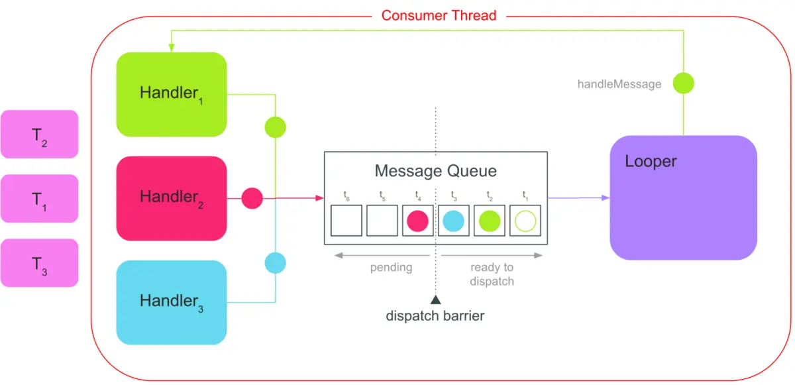

# Android

> 小小操作系统

activity 就是掌握生命周期

fragment 和activity生命周期的区别和联系，怎么添加fragment，fragment和activity通信

service 也是在生命周期是做事情，activity绑定service进行通信，IntentService异步可自动退出的服务

broadcastRecevier


## AsyncTask 异步

这个早被弃用了，感觉这个东西太简单，方便，所以会有一些漏洞。现在多用java的并发包工具和Handler


## Handler 机制

> 它的存在就是因为Android中主线程才能更新UI，主线程不能执行耗时操作，所以得要用子线程

首先得了解异步消息处理机制：由Message、MessageQueue、Looper、Handler四部分组成；执行流程就是创建一个message对象，Handler将这个message放到MessageQueue中，然后Looper发现消息队列中有数据就将数据取出来交给Handler的handleMessage方法处理

```java
override fun onCreate(savedInstanceState: Bundle?) {
        super.onCreate(savedInstanceState)
        binding.fab.setOnClickListener {
            thread {
                val msg = Message()
                msg.what = 1//msg可以携带多种类型数据
                handler.sendMessage(msg)//开启线程将消息发送出去
            }
        }
}
private val handler = object : Handler(Looper.getMainLooper()) {//绑定到主线程和主线程的消息队列
        override fun handleMessage(msg: Message) {//主线程接受消息处理消息
            //super.handleMessage(msg)
            when(msg.what) {
                1 -> print("消息来了...")//就可以在UI线程修改页面处理了
            }
        }
}//可以说主线程的Looper、MessageQueue、Handler吗？可以  多个子线程可以对应多个Handler，向里面发送消息
```

由上面就知道Handler用于进程中线程间的通信，而Android中进程间通信用的是Binder

- Message 专门给Handler处理的消息或Runnable对象，既可以存储简单数据也可以存储复杂类型数据，单链表数据结构，MessageQueue用链表结构实现队列

  ```java
  int what;int arg1;Object obj;Bundle data;//里面有这些字段
  private static final int MAX_POOL_SIZE = 50;//消息最大为50
  ```

  消息池 sPool Message里面用sPool指向单链表顶部来实现栈，它的作用是消息使用后会被回收在这，这部分消息是为了重复利用，并且采用了享元模式避免重复消息对象；创建Message的首选是调用Message.obtain()，源码里面推荐的，本来也是这个道理。

  

  ```java
  public long when;//这个可以在传递消息时设置，MessageQueue中Message的顺序就看这个值的大小 测试时使用
  Handler target;//保存处理当前消息的Handler
  int flags;//消息的状态标记 0、FLAG_IN_USE、FLAGS_TO_CLEAR_ON_COPY_FROM、FLAG_ASYNCHRONOUS
  
  public Messenger replyTo;
  //可选的Messenger，可以发送此消息的回复。具体如何使用的语义取决于发送方和接收方
  ```

- Looper  用于为线程运行消息循环，提供线程上下文环境，创建与线程绑定；创建管理MessageQueue；消费者模式(没消息就阻塞等待)的Looper在MessageQueue中获取消息(只要Looper还在就一直运行，要不跟随应用退出，要不就阻塞)，并叫Handler处理消息；

  **一个Looper只对应一个线程，反之同样**，比如Looper.getMainLooper()就是对应当前主线程，为什么能直接获取，因为Android在系统启动的时候就用ActivityThread.java创建了

  ```java
  /**
  *Returns the application's main looper,which lives in the main thread of the application.
  */
  public static Looper getMainLooper() {
  private Looper(boolean quitAllowed) {
  //Looper的构造函数是私有的，通常都是由静态方法prepare()来创建;上面这个方法也是一样用来创建Looper
  public static void loop() {//这个方法是用来不断从MessageQueue中取消息的
      
  //这是一个源码中实现Looper线程的典型示例，使用prepare和loop的分离来创建一个初始Handler来与Looper通信。
     class LooperThread extends Thread {
         public Handler mHandler;
   
         public void run() {
             Looper.prepare();//初始化当前线程的Looper
   
             mHandler = new Handler(Looper.myLooper()) {
                 public void handleMessage(Message msg) {
                     // process incoming messages here
                 }
             };
   
             Looper.loop();//进入循环消息模式，有Message就将它发送给它内部target引用的Handler
         }
     }
  ```

- Handler 它的子类必须为static，避免内存泄露；用于发送消息、处理消息、移除消息；Looper在哪个线程是由Handler初始化位置决定。

  从它的构造方法可以看出创建Handler就意味着Looper，MessageQueue，Callback，mAsynchronous的创建

  而且源码里面有创建消息的方法，但是直接用Message比较好

  ```java
  public Handler(@NonNull Looper looper, @Nullable Callback callback, boolean async) {
          mLooper = looper;//如果构造函数中没Looper就使用默认Looper
          mQueue = looper.mQueue;//使用looper中创建的MessageQueue
          mCallback = callback;//设置回调接口，默认为null
          mAsynchronous = async;//默认同步
  }
  public final Message obtainMessage() {//就这个，少用
          return Message.obtain(this);
  }
  public final boolean sendMessage(@NonNull Message msg) {
          return sendMessageDelayed(msg, 0);//在当前时间之前的所有挂起消息后，将消息压入消息队列的末尾
  }
  ```

- MessageQueue  前面说过了消息队列是Looper中创建的，这个队列中Message位置是由Message中when值排序的先进先出；

  ```java
  Message next() {//Looper会调用这个来取消息，这里面有个nativePollOnce(ptr, nextPollTimeoutMillis)调用来判断没消息后的阻塞
  
  ```

- HandlerThread创建与销毁  由两个Handler和一个HandlerThread实现后台线程串行执行；有一个循环器的线程。然后可以使用循环程序创建处理程序。注意，就像普通线程一样，start()仍然必须被调用。内部实现机制主要是实现了Looper；它的退出在activity中将引用设置为null就行；

  ```java
  //示例： UI线程的Handler
  Handler mHandler = new Handler(){//这个空构造现在已经被弃用
      @Override
      public void handleMessage(Message msg) {
          super.handleMessage(msg);
          // 处理UI更新
  };
  
  HandlerThread mBackThread = new HandlerThread("mybackthread");
  mBackThread.start();
  // 后台线程的Handler
  Handler mBackHandler = new Handler(mBackThread.getLooper());//初始化在start()之后，为了得到mBackThread的Looper
  
  mBackHandler.post(new Runnable() {//把这个Runnable放到消息队列中，开启一个线程起到多个线程的作用
      @Override
      public void run() {
          // 后台线程执行耗时操作，异步后台任务执行；这个其实和最开始的异步消息处理机制相似，但是这个
          //比Thread多了个消息循环机制(有自己的Looper)，还更容易管理
          ...
          // mHandler发消息，回到主线程更新UI
          mHandler.sendMessage(msg);
      }
  });//用完及得退出，避免内存泄露，使用quit或quitSafely(清空消息之前把非延迟消息派发出去处理)
  //使用场景：对于非UI线程又想用消息机制时、替换平时的Thread匿名线程使用、I/O操作
  ```
  
  Android中多个线程创建的多个不同的Handler都关联到主线程的Looper，一个Looper对应一个线程和消息队列
  
  

> 项目中就用这个机制来不断发送收集event

## Binder 机制

> 之前的Handler主要是创建一个子线程并在里面循环处理消息，属于子线程之间的消息传递；这个Binder属于进程间的通信机制，比如activity和service就是两个进程，他们通信方式之一就是Binder机制。
>
> 一开始接触Binder的用法是activity绑定后台service，并且可以调用service里面的方法，这样就得用到Binder机制。
>
> 首先为什么要有Binder，因为每个应用运行在自己的进程中，进程这个东西是在内存中的，然后Linux中有个东西叫内核Kernel，它也叫内核空间，也在内存中，是一块用于进程与硬件间交流的“中间人”，这个内核中间人它很严格，保证整个系统的生态正常运行；但是现在需要进程和进程之间通信怎么办呢，这得需要内核它老人家同意啊，这时就出现个老人家的徒弟，让进程可以通过徒弟去劝说内核老人家处理通信这件事，这个徒弟就在内核态空间中一个角落，叫动态可加载模块(Loadable Kernel Module，LKM)，这个模块也叫Binder驱动，驱动进程-硬件-进程的数据传输。
>
> 然后有个问题，Linux中进程通信不是有管道、socket这些吗，为什么还要弄个Binder这个出来？主要有安全和性能两方面原因，Binder它在安全上使用的机制可以对通信的两方做身份验证，比socket更安全，在数据传输上也更高效。
>
> 下面是简单的activity绑定后台service，用Binder进行通信，还有AIDL也是用Binder通信。

```kotlin
class MyService : Service() {//后台service
    private val mBinder = DownloadBinder()
        class DownloadBinder : Binder() {
            fun startDownload() {
                Log.d("MyService", "startDownload executed")
            }
            fun getProgress(): Int {
                Log.d("MyService", "getProgress executed")
                    return 0
            }
        }
    override fun onBind(intent: Intent): IBinder {
        return mBinder//连接完后会回调这个方法返回Binder对象
    }
    ...
}
//activity绑定service并调用里面的方法
lateinit var downloadBinder: MyService.DownloadBinder
    private val connection = object : ServiceConnection {
        override fun onServiceConnected(name: ComponentName, service: IBinder) {
            downloadBinder = service as MyService.DownloadBinder
            downloadBinder.startDownload()//用Binder对象控制
            downloadBinder.getProgress()
        }
        override fun onServiceDisconnected(name: ComponentName) {
        }
    }
override fun onCreate(savedInstanceState: Bundle?) {
...
    bindServiceBtn.setOnClickListener {
    val intent = Intent(this, MyService::class.java)
        bindService(intent, connection, Context.BIND_AUTO_CREATE) // 绑定Service
}
    unbindServiceBtn.setOnClickListener {
        unbindService(connection) // 解绑Service
    }
}

//AIDL的IPC通信
//服务端
class MyService : Service() {

    private val mBinder = object : IMyAidlInterface.Stub() {
        override fun saveData(data: String?) {
            if (data != null) {
                ,,,//执行数据保存动作
            }
        }
    }
    override fun onCreate() {
        super.onCreate()
    }
}
//客户端
class MainActivity : AppCompatActivity() {
    private val TAG = "MainActivity"
    var remoteInterface: IMyAidlInterface? = null

    private val connection = object : ServiceConnection {
        override fun onServiceConnected(name: ComponentName?, service: IBinder?) {
            remoteInterface = IMyAidlInterface.Stub.asInterface(service)
        }

        override fun onServiceDisconnected(name: ComponentName?) {
        }
    }

    private fun bindRemote() {
        val intent = Intent()
        intent.component =
            ComponentName("com.example.serviceaidl", "com.example.serviceaidl.MyService")

        var bindService = bindService(intent, connection, Context.BIND_AUTO_CREATE)
    }

    override fun onCreate(savedInstanceState: Bundle?) {
        super.onCreate(savedInstanceState)
        setContentView(R.layout.activity_main)
        val sendButton: Button = findViewById(R.id.sendRemote)
        val editData: EditText = findViewById(R.id.editData)

        sendButton.setOnClickListener {
            val dataNum: String = editData.text.toString()

            bindRemote()
            remoteInterface?.saveData(dataNum)
        }

    }

    override fun onDestroy() {
        super.onDestroy()
        unbindService(connection)
    }

}
//在AIDL生成的接口文件中有Binder代理对象和Binder本地对象
//如果这个service是和activity在一个项目中，那就是本地对象
//如果service在别的app中，那使用的就是Binder代理对象来进行信息传递
//
```

> 实现原理：在内核空间的Binder模块中有个叫ServiceManager，它会保存每个service进程的信息。
>
> 注意这里可能不是activity向Binder通知，但是肯定是一个进程
>
> 具体就是activity会向Binder通知，叫Binder建立SM，然后每个service进程启动后会向SM记录自己的信息，所以进程间通信就得经过Binder和SM这部分。然后其实客户端调服务端这样的IPC，客户端调用服务端中的方法，看起来是在客户端中调用了，但实际上客户端中调用方法这个动作只是给Binder一个信号(代理对象)，让Binder从SM中找到这个服务端，然后叫服务端执行这个方法，然后返回结果(也是一个代理对象)，Binder再把这个结果给客户端。
>
> 到现在就可以发现Binder内部操作挺多的，但是在使用上来看很简单，客户端自己做命令，服务端自己执行。这就是面向对象思想中的封装复杂操作，让使用者轻松使用这个机制。


## Camera2

> Camera2在Android5.0推出的，它出现是为了替换废弃的Android4.4 Camera应用级相机框架

android.info.supportedHardwareLevel：不是每个Android5.0以上的设备支持Camera2API所以功能，所以得用这个来查询设备支持程度：

- INFO_SUPPORTED_HARDWARE_LEVEL_LEGACY 旧版，功能和废弃的CameraAPI差不多
- INFO_SUPPORTED_HARDWARE_LEVEL_LIMITED 有限，设备能做的功能占Camera2大部分，并且得使用HAL3.2以上版本
- INFO_SUPPORTED_HARDWARE_LEVEL_FULL 全部，设备能提供所有Camera2中所有功能，但得使用HAL3.2及Android5.0以上版本
- INFO_SUPPORTED_HARDWARE_LEVEL_3 级别3，设备支持YUV和RAW流处理
- INFO_SUPPORTED_HARDWARE_LEVEL_EXTERNAL 外部相机使用

Camera2主要类：

- CameraManager 相机管理，用来检测摄像头，打开摄像头，获取摄像头支持

  ```java
  //使用之前在<uses-permission android:name="android.permission.CAMERA"/>
  //AvailabilityCallback 相机设备开启后会产生回调
  public static abstract class AvailabilityCallback {
      public void onCameraAvailable(@NonNull String cameraId) {}
      public void onCameraUnavailable(@NonNull String cameraId) {}
  }
  ```

  

- CameraDevice 物理或逻辑摄像头

  ```java
  //上面的API打开摄像头后提供回调接口，这样执行CameraDevice中的API后会回调到这
  public static abstract class StateCallback {
      // 当 CameraDevice.close() 调用时会触发；如果设备已经关闭，
      // 后续再次调用 CameraDevice 相关方法会抛出异常 IllegalStateException
      public void onClosed (CameraDevice camera){...}
      // 表示设备不能再被使用；再次访问会抛出 CameraAccessException
      public abstract void onDisconnected (CameraDevice camera){...}
      // 开启设备失败；再次访问抛出 CameraAccessException，并给出 error
      public abstract void onError (CameraDevice camera, int error);
      // 设备被正常打开
      public abstract void onOpened (CameraDevice camera);
  }
  ```

  

- CameraCaptureSession 应用程序和CameraDevice之间的会话通道类，传输从摄像头捕获的数据和从新处理之前同一会话中的数据，数据在surface中渲染输出

  ```java
  //CameraCaptureSession需要异步执行，它会创建会话管道和数据缓冲区，这个过程耗时
  CameraCaptureSession.StateCallback//会话通道建立完成后，通道的状态变化会回调到这里面
  CameraCaptureSession.CaptureCallback//捕获结果回调
  CameraConstrainedHighSpeedCaptureSession//该类的子类，表示高速会话通道，用来传输高帧率数据
  ```

  

- CameraMetadata 摄像头的控制命令，固定的，给CameraDevice的命令，请求摄像头的参数、捕获结果

  ```java
  //抽象类，键值对的数据结构，固定的，只有一个公共方法来获取键值信息
  public List<TKey> getKeys() {
      Class<CameraMetadata<TKey>> thisClass = 
          (Class<CameraMetadata<TKey>>) getClass();
      return Collections.unmodifiableList(
              getKeys(thisClass, getKeyClass(), this, /*filterTags*/null));
  }
  ```

  

- CameraRequest 从相机设备获取数据的请求，一些命令

  ```java
  //继承CameraMetadata，意思就是带着命令控制CameraDevice，从中获取数据
  ```

  

- CameraResult 从相机设备得到的返回结果

  ```java
  //同样继承CameraMetadata
  ```

  

- CameraCharacteristics 描述CameraDevice相机设备的属性，固定的，每个手机有不同的摄像头属性，用CameraManager.getCameraCharacteristics(String cameraID)来查询

  ```java
  //这个也是固定的数值，
  ```

  

> 流程就是CameraManager检测并打开CameraDevice，建立应用和相机设备之间的CameraCaptureSession通道传输数据，CameraRequest用CameraMetaData命令发送数据下去，然后返回CameraResult


## View事件分发机制


## 配置测试发布

一个APP的从0到1：

1. 配置开发环境：就是配置电脑环境、Androidstudio软件、然后再根据开发的APP创建项目
2. 编写代码：利用AndroidStudio写代码、设计界面、插入资源等
3. 构建运行：配置好build.gradle，生成对应调试apk在测试机上运行
4. 调试分析和测试：与测试组结合解决bug，用工具查看APP内存、CPU、网络、渲染等性能，并优化
5. 发布到应用商店：APP代码设计、代码、bug、性能等问题解决完后用安全密匙签名，发布到Google商店

## 1. 设置开发环境

> 设置jdk，sdk，下载个AndroidStudio，配置好就是

### 2. 编写代码

工具：

- PNG\JPEG和webp图片转换：搞张图片放到IDEA中右键直接转换，选无损或有损就OK了
- lint 工具用于检查代码是否存在可能影响 Android 应用的质量和性能的结构问题


# 其它技术

> 技术，检验基础与实践

## Protocol Buffers

> Protocol Buffers是一种用于序列化结构化数据的与语言无关、与平台无关的可扩展机制。
>
> 为什么使用它，就是因为它在网络上传输流量使用少，存储时所占用的空间小；它比java自带的序列化好，没有XML的空间密集型(会对解编码造成性能损失)

**特性：**

- 它就是一个谷歌的序列化机制，和xml差不多，而且体积更小，更快，更简单.
- 用于结构化数据与数据流之间的转换；它可以用在java、Python、C++、go等语言项目中.
- 它向后兼容性好，后面对`.proto`添加删除字段是不会影响现有的proto服务.
- 支持不同语言转换，与别的语言共享数据，用java生成的序列化数据可以用Python来解析出来.

**不适合场景：**

- 消息体积大的场景，因为它是一次加载到内存的方式，所以对应几兆以上的数据就不推荐用这个
- 读取序列化数据场景，因为它可能会将相同数据转为不相同的二进制序列化，得再解析出来一次才能知道是相同的
- 科学项目场景，因为一些浮点数太长的它的转换都不太好

**使用：**定义数据结构化方式`.proto` - 编译器工具转为源代码 - 对应语言将结构化数据写入数据流或将数据流转为结构化数据

1. 

web项目使用：添加Maven配置<dependency>...

Android使用：build.gradle中添加依赖`implementation 'com.google.protobuf:protobuf-java:3.22.2'` 注意版本号，Android中推荐使用Java Lite

`For Android users, it's recommended to use protobuf Java Lite runtime because of its smaller code size.`

2. 

编译器工具中添加.proto文件，并且在里面定义结构化语言对应的消息；为要序列化的每个数据结构添加一条消息；

```protobuf
message Person {
  optional string name = 1;
  optional int32 id = 2;
  optional string email = 3;
}
```

用proto编译器工具将.proto文件转换为对应的语言(源代码)，这个源代码里面描述的就是包含每个字段的简单访问器和方法；每个消息对应.java文件中一个类和一个用来产出流的Builder类

使用protobuf API写入和读取消息：该类提供的get/set方法将字段转换为高效二进制格式，

```java
Person john = Person.newBuilder()
    .setId(1234)
    .setName("John Doe")
    .setEmail("jdoe@example.com")
    .build();
output = new FileOutputStream(args[0]);
john.writeTo(output);
```

在java项目中就可以用生成类源代码文件中的方法将 结构化语言 与 原始字节流互相转换；


**工作原理：**


**.probo语法概括：**

```protobuf
//示例
enum EnumNote {
  ENAA = 0;
  ENBB = 1;
}
message Person {
  optional string name = 1;
  optional EnumNote id = 2;
  optional string email = 3;
}
```

定义字段时，可以定义可选、可重复、单数的；定义消息`message`来嵌套数据集、定义枚举`enum`能规定一组值供选择、定义`oneof`可选字段能在字段中选择其中一个、定义`map`映射能添加键值对数据。

数据类型可以有基本数据类型，其他数据类型(不常用，比如Timestamp、Duration,相比于用这个，更应该在程序中自定义使用)

字段编号给不能重复，如果删除字段就保留编号，防止混乱使用

**.proto语法：**

- 如果需要使用proto3，需要在.proto文件的首行定义`syntax = "proto3"`

- 一条消息表示一个结构化数据，其实可以看做一个对象，只是这个对象体积很小

  ```protobuf
  message Person {
    optional string name = 0;//字段
    optional string email = 1;//这里也可以用非基本类型，比如枚举，其他消息类型
  }
  ```

- 字段编号不能重复，1~15占一个字节，16 ~2047占两个字节，1 ~15最好给频繁出现的字段

- 如果想删除字段，为了避免以后误重复使用造成数据问题，可以使用保留字段

  ```java
  message Foo {
    reserved 2, 15, 9 to 11;
    reserved "foo", "bar";
  }
  ```

- 如果在项目中不给消息字段set值，那这个消息字段默认为对应类型的默认值

- 如果想限制消息字段的取值就用enum枚举

  ```java
  enum Corpus {
    CORPUS_UNSPECIFIED = 0;//从0开始,对应枚举value值
    CORPUS_UNIVERSAL = 1;
    CORPUS_WEB = 2;
  }
  ```

okk，结束protobuf，在项目中够用了，注意版本不同，里面有些定义是会过时的，看官网说明就行

官方文档：https://protobuf.dev/		不同语言项目所需编译器下载：https://github.com/protocolbuffers/protobuf

## Retrofit


## OkHttp


## SQLite

