# 设计模式
> 抓住本质，理解思想，举一反三
>
> 结合经验与书籍总结《设计模式》《秒懂设计模式》《大话设计模式》

设计模式思考：<br>问：感觉有的设计模式差不多啊？<br/>答：不对<br>问：原型模式用return this行吗？<br/>答：肯定不行啊，那不还是返回自己的引用，也没clone新的一份。

慢慢地发现每种设计模式都是最大限度地体现六大设计原则。

设计模式像不像下面的这样：本来代码处理一个问题就用两堆代码解决，但是有设计模式的参与下，只需要他们的交集的一点点代码加一点巧妙逻辑也能解决，让代码更工程化。


## 1. 概念

一套代码设计、代码体系结构的经验总结，和只会调用api工具箱的工程师不同，这个主要是面向框架，让代码编制更加工程化，让项目更加有可靠性、可扩展性、可重用性、可维护性、可移植性等特点，设计模式是用面向接口编程来降低耦合的。后面就会发现会用到很多接口来参与设计。

软件产品的不断迭代更新，设计模式根据各种场景提供了最优的设计方式，让每个模块最大限度得到复用及扩展。设计模式其实不是什么技术，而是软件工程一种思想，一种格局。

面向对象：实际存在的现实实物就是对象，计算机中由类(模型)来创建对象，发现造物的过程中模型之间有千丝万缕的关系，就像人与房屋有关系(对象就是小明住在202)，所以在代码设计中就得考虑用面向对象的三大特性(封装、继承、多态)来处理这千丝万缕的关系。 

- 封装就是将变量和方法放在一个类中，然后给这个类提供接口访问类中的东西，这样的类就干净整洁，但是不能把不相关的东西封装在一起，所以封装也得适度；

- 继承就是避免出现重复代码，子类有父类的东西，子类可以重写父类的东西，子类可以扩展父类的东西；

- 多态就是父类的引用可以指向本类对象或者子类的对象。面向接口编程的重要性在这可以体现了。

## 2. 背景

设计模式起源于建筑设计大师看到当时没有一个好的建筑结构规范，它想要改善人类的生活住所条件。后面才有了设计模式(可复用面向对象软件)，设计模式也是从C++模仿过来的。

设计模式格式：当设计出一个设计模式后，你想要全国的人知道，然后你讲解，你就带按照这个格式描述你的设计模式，这就是GoF格式。

- 模式名：有意义、简短而准确地描述设计模式，让人们交流起来方便，可以直接体现内涵的名字；
- 问题：该设计模式的出现，是为了解决什么问题下使用，和使用了这个设计模式会有怎样的结果；
- 环境：这个设计模式在什么环境下使用，这个设计模式的使用范围；
- 解决方案：这个设计的组成，之间是怎样协作的，每个成分的职责是什么，用一个抽象的描述来处理不同实际问题；
- 效果：用这个设计模式处理这个问题的结果怎样，有哪些弊端，有哪些时间空间上的优势；
- 例子：使用一个代表性的，能让别人理解设计模式的代码示例；
- 末态环节、推理、其他有关模式、已知应用。

## 3. 分类

> 23种设计模式，三大类型：创建型，结构型，行为型

- 创建型：单例模式、工厂方法模式、抽象工厂模式、建造者模式、原型模式；
- 结构型：代理模式、装饰模式、适配器模式、组合模式、桥梁模式、外观模式、享元模式；
- 行为型：模板方法模式、命令模式、责任链模式、策略模式、迭代器模式、中介者模式、观察者模式、备忘录模式、访问者模式、状态模式、解释器模式。

## 4. 设计原则

- 单一职责原则：就是封装得封装得好，一个类应该只有一个职责，为了模块解耦、可读性、可维护性、复用性、降低变更引起的风险

  应用：Javaweb中的分层思想，dao层、service层、controller层

- 里氏替换原则：这里就是继承和多态用得好，父类引用可以指向本类对象或子类对象

- 依赖倒置原则：就是面向接口编程用得好，底层模块依赖高层模块，高层模块不依赖底层模块，实现类(子类)依赖接口或者抽象类，依赖关系是由接口或抽象类来实现

  应用：在中大型项目中常用，用于扩展和维护，是实现开闭原则的方式之一

- 接口隔离原则：使用接口编程是一个很好的习惯，但是设计时得考虑接口粒度大小，粒度太小会导致接口数量剧增，太大会导致灵活性降低，所以设计时考虑这个接口中方法是否与模块子类匹配。

- 迪米特原则：一个对象应当对其他对象尽可能少地了解。就是A类和B类有联系，B类和C类有联系，这样如果A类想和C类交流，就直接和B类交流就行，没必要再去找C类。

- 开闭原则：对扩展开放，对修改关闭，尽可能少地修改源代码。上面的原则其实都是为了开闭原则服务的，都是工具。

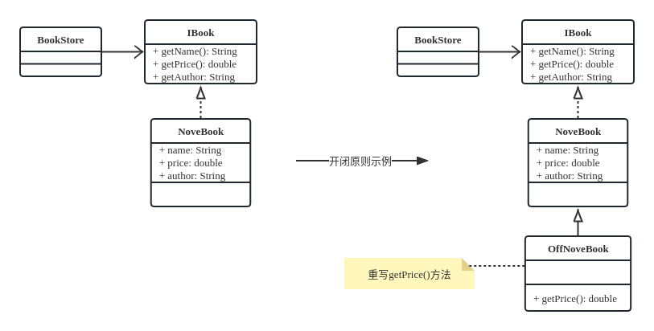

```java
public interface IBook {
    public String getName();
    public double getPrice();
    public String getAuthor();
}
//----------------
public class NoveIBook implements IBook {
    //书名
    private String name;
    //价格
    private double price;
    //author
    private String author;
    public NoveIBook() {
    }
    public NoveIBook(String name, int price, String author) {
        this.name = name;
        this.price = price;
        this.author = author;
    }
    @Override
    public String getName() {
        return name;
    }
    @Override
    public double getPrice() {
        return price;
    }
    @Override
    public String getAuthor() {
        return author;
    }
}
//----------------
public class BookStore {
    private ArrayList<IBook> bookList = new ArrayList<>();
    public BookStore() {
        bookList.add(new OffNoveIBook("西游记",23,"吴承恩"));    //修改时就改这里OffNoveIBook
        bookList.add(new OffNoveIBook("红楼梦",32,"曹雪芹"));    //改成NoveIBook
    }
    public void showBookList() {
        System.out.println("----     书店列表     ----");
        System.out.println("书名\t价格\t作者");
        for (IBook iBook : bookList) {
            System.out.println(iBook.getName() + "\t" + iBook.getPrice() + "\t" + iBook.getAuthor());
        }
    }
    public static void main(String[] args) {
        BookStore bookStore = new BookStore();
        bookStore.showBookList();
    }
}
//----------------增加活动打折方案
public class OffNoveIBook extends NoveIBook {
    public OffNoveIBook(String name, int price, String author) {
        super(name, price, author);
    }
    @Override
    public double getPrice() {
        return super.getPrice()*0.8;
    }
}
```

## 5. 创建型（5种）

> 创建管理实例的不同方式和操作，对创建对象的过程进行封装

### 5.1 单例模式

> 懒汉式、饿汉式，构造方法私有，获取实例加synchronized

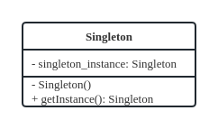

```java
//饿汉式
public class Singleton {
    //太饿了，先实例化
    private static Singleton singleton_instance = new Singleton();

    //构造函数私有
    private Singleton() {
    }

    public static Singleton getInstance() {
        return singleton_instance;
    }
}
//懒汉式
public class Singleton {
    private static Singleton singleton_instance = null;

    //构造函数私有，不让外面创建实例
    private Singleton() {
    }

    //方法同步
    synchronized public static Singleton getInstance() {
        if (singleton_instance == null) {
            singleton_instance = new Singleton();
        }
        return singleton_instance;
    }
}

//优点：减少内存和系统开销，创建只创建一次，在内存中也只有一份。
//缺点：构造函数都被私有了,无法拓展子类。
//注意：使用单例得注意有状态单例和无状态单例，有状态单例会在分布式系统中存在多份实例，还有序列化的问题。

//懒加载更好运行效率的方式，加“双检锁”
public class Singleton {
    private static volatile Singleton singleton_instance = null;

    private Singleton() {
    }

    public Singleton getInstance() {
        if (singleton_instance == null) {
            synchronized (Singleton.class) {//在这加锁就是为了运行效率，如果一个线程创建了实例就不用走这了，不用让线程等待，直接用之前线程创建的实例
                if (singleton_instance == null) {
                    singleton_instance = new Singleton();
                }
            }
        }
        return singleton_instance;
    }
}
//饿汉式优点就是保证唯一性，但是在系统启动时加载时间会比较长
//懒汉式优点就是系统启动快，实例延迟加载，但是得用“双检锁”来解决多线程访问的问题

//使用场景：1整个项目中共享数据，2创建一个对象消耗的资源过多
```


### 5.2 工厂方法模式

> 将产品对象的创建放到子类工厂中进行控制，目的就是封装创建产品对象的过程
>
> 将一个类的实例化延迟到子类

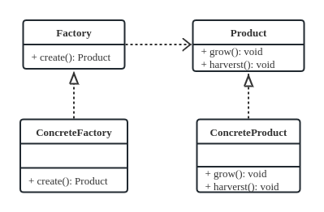

```java
public interface Factory {
    public Product create();
}
public interface Product {
    public void grow();

    public void harvest();
}
public class ConcreteFactory implements Factory {//自由扩展工厂不同操作
    //工厂生产产品
    public Product create() {
        return new ConcreteProduct();
    }
}
public class ConcreteProduct implements Product {//自由扩展不同产品种类
    public void grow() {
        //增长
    }
    public void harvest() {
        //行为
    }
}
public class ClientDemo {
    public static void main(String[] args) {
        ConcreteFactory concreteFactory = new ConcreteFactory();
        Product product1 = concreteFactory.create();
        product1.grow();//可以不用这个，工厂类也可以封装调用产品的业务方法
    }
}
//工厂方法模式就是在别的地方封装一下new对象的过程，现在将实例化封装在工厂中，也是为了系统的可扩展性和耦合性
//优点：封装，可扩展
//唯一的缺点就是产品类的增加同时也得增加对应的工厂类，就这有点麻烦，其实还行
```


### 5.3 抽象工厂模式

> 和工厂模式不同的是抽象工厂模式有多个产品，处理时是封装对产品组进行对象创建，处理

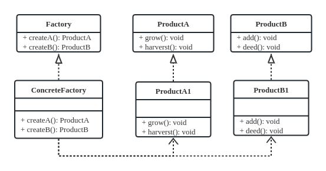

```java
public interface Factory {
    public ProductA createA();
    public ProductB createB();
}
public interface ProductA {
    public void grow();
    public void harvest();
}
public class ConcreteFactory implements Factory {
    //工厂生产产品
    public ProductA createA() {
        return new ProductA1();
    }
    public ProductB createB() {
        return new ProductB1();
    }
}
public class ProductA1 implements ProductA {
    public void grow() {
        //增长
    }
    public void harvest() {
        //行为
    }
}
public class ProductB1 implements ProductB {
    public void add() {
        //增长
    }
    public void deed() {
        //行为
    }
}
public class ClientDemo {
    public static void main(String[] args) {
        ConcreteFactory concreteFactory = new ConcreteFactory();
        Product productA1 = concreteFactory.createA();
        Product productB1 = concreteFactory.createB();
        productA1.grow();
        productB1.add();
    }
}
//优点：在工厂方法模式基础上可以对一系列有相同约束的产品种类进行封装创建对象
//缺点：产品种类增加，得手动修改工厂接口
```

### 5.4 建造者模式

> 产品本身只有属性，产品的组成和操作放在建造者那处理，对了，建造者由导演控制那些操作

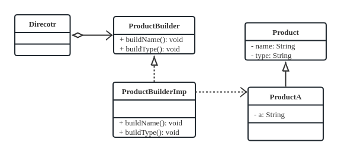

```java
//产品抽象类
public abstract class Product {
    private String name;
    private String type;
    //省略get,set方法
}
//具体产品，但是还没建造好，得由建造者来建造
public class ProductA extends Product {
    private String a;
    public Product(String a){
        this.a = a;
    }
    public String getA(){
        return a
    }
}
//建造者接口
public interface ProductBuilder {
    void buildName();//抽象出产品的组成
    void buildType();//抽象出产品的组成
}
//建造者对产品做的事情
public class ProductBuildImp extends ProductBuilder {//可以有多个建造者
    private ProductA productA = new ProductA("A-12号")
    void buildName() {
        productA.setName("飞机")
    }
    void buildType() {
        productA.setType("民用")
    }
}
//导演控制建造者的动作，封装内部操作
public class Director{
    ProductBuilder product;
    public Product constructA() {
        product = new ProductBuildImp();
        product.buildName();
        product.buildType();
        return product;
    }
}
//优点：可以封装内部组成和操作
//建造者独立，易于扩展，常用在产品执行方法顺序不同产生结果不同时，还有建造者操作顺序不同产生不同结果，这时候用建造者就很合适，所以建造者侧重于装配零件和装配顺序
//也叫生成器模式，将一个复杂对象的构建与其表示分类，使得同样的构建过程可以创建不同的产品
```

### 5.5 原型模式

> clone原型的对象来进行不同的处理，比new对象效率高，因为这是直接克隆一份内存二进制流

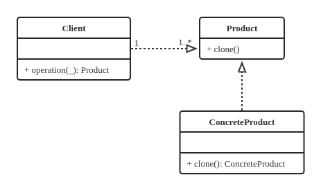

```java
public interface Product extends Cloneable {
    //重写父clone方法，说明实现类可以被clone
    Product clone();
}

public class ConcreteProduct implements Product {
    private Parts parts;
    public Product clone() {
        try {
            Product p = (Product) super.clone();
            p.setParts(this.parts.clone());//这个是手动用深克隆给引用对象重新弄一份，不然还是那一份
            return p;
        } catch (CloneNotSupportedException e) {
            e.printStackTrace();
            return null;
        }
    }
}

public class Client {
    public Product cloneOperation(Product example) {
        // 得到example的副本来使用
        Product p = example.clone();
        return p;
    }
}
//原型模式比创建对象性能好，它是直接克隆内存对象的二进制流得到一份，规避了构造方法，省了初始化对象里面值的步骤
//就像设计师辛苦用木板(类)雕刻出一个模子(对象)，然后就可以用这个模子去快速印出花纹，这就是原型模式的意思，不用再重复用木板雕刻模子。
//浅克隆和深克隆的问题，如果ConcreteProduct类中有一个引用变量，那普通的clone就是浅克隆，克隆出的几个产品用的都是相同引用，所以这时就得用深克隆，在克隆出新产品后再在这个新产品对象中再克隆这个引用的对象。
//深克隆的解决方法还有另一种就是实现Serializable通过序列化来处理clone
//缺点就是每个类都得写一份clone的方法，只要clone就得重写clone方法
```

### 创建型总结

单例和原型都简单，主要思考工厂方法、抽象工厂、建造者的特点；工厂方法是对单个产品对象的封装创建处理；抽象工厂是对产品对象组的封装创建处理；建造者是对产品对象封装创建，然后组装，不同组装过程产生不同产品。

## 6. 结构型（7种）

> 通过继承或组合让类和对象形成更大的结构，来适应更高层次逻辑需求
>
> 当想到看到有几个点，这几个点有个什么关系应该放到一起就可以组成更大的结构，就用结构型
>
> 点线面的场景

### 6.1 代理模式

> 为其他对象提供一种代理以控制对这个对象的访问。代理类可以在目标对象做的事情前后做一些事情，本身的真实角色就是被代理类有自己的业务操作，代理类就是在被代理类的基础上做另外的操作。

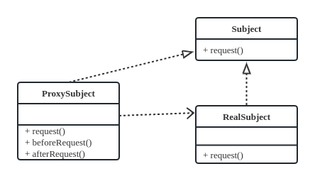

```java
    public interface Subject {
        //定义一个请求方法
        public void request();
    }
    public class RealSubject implements Subject {
        public void request() {
            // 业务逻辑处理
        }
    }
    public class ProxySubject implements Subject {
        private Subject subject;
        public ProxySubject(Subject subject) {
            this.subject = subject;
        }
        // 实现请求方法
        public void request() {
            this.beforeRequest();
            subject.request();
            this.afterRequest();
        }
        // 请求前的操作
        private void beforeRequest() {
            // 预处理
        }
        // 请求后的操作
        private void afterRequest() {
            // 善后处理
        }
    }
//代理还可以分为远程代理、虚拟代理、保护代理、缓存代理等
//优点就是不影响真实业务的前提下间接做别的操作，比如安全，日志；提高扩展性
```

### 6.2 装饰模式

> 利用继承来给具体构件增加另外的功能操作。其实和代理模式差不多，只是这个有继承关系的参与

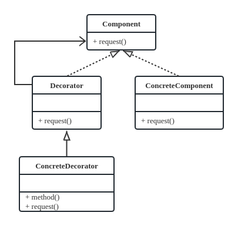

```java
public interface Component {
    public void request();
}
public class ConcreteComponent implements Component {
    public void request() {
        //业务代码
        System.out.println("模式");
    }
}
public abstract class Decorator implements Component {
    private Component component = null;

    public Decorator(Component component) {
        this.component = component;
    }
    public void request() {
        this.component.request();
    }
}
public class ConcreteDecorator extends Decorator {
    public ConcreteDecorator(Component component) {
        super(component);
    }
    //定义自己的方法
    private void method() {
        System.out.println("修饰-");
    }
    //重写operation方法
    public void request() {
        this.method();
        super.request();
    }
}
//使用
public class Client {
    public static void main(String args[]) {
        Component component = new ConcreteComponent();
        //进行装饰
        component = new ConcreteDecorator(component);
        component.request();
    }
}//输出：装饰-模式
//这个比代理模式好就是装饰子类可以有多个，可以扩展不同类，从而扩展不同功能；这样的方式就比单纯继承的灵活性好
```

### 6.3 适配器模式

> 前提是当一个对象或类的接口不能匹配用户所期待的接口时，用适配器，将一个接口或类转换为另一个接口或类，其实就是在实现接口时重写的那个方法中用super调用适配器类的父类的方法。也就是用适配器实现接口方法去执行原来的继承类中的方法，实现适配两个没有关系类的效果

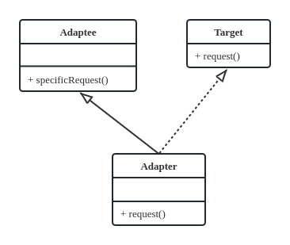

```java
public class Adaptee {
    //原有业务处理
    public void specificRequest() {
    }
}
public interface Target {
    public void request();
}
public class Adapter extends Adaptee implements Target {
    public void request() {//适配Target接口
        super.specificRequest();
    }
}
//使用
public class Client {
    public static void main(String args[]) {
        //适配器模式应用
        Target target = new Adapter();
        target.request();
    }
}
//扩展类功能，增加类功能，改装类功能
```

### 6.4 组合模式

> 用对象组成树型结构，主要解决含有树形结构的问题，比如树枝叶子，公司职位树，文件系统

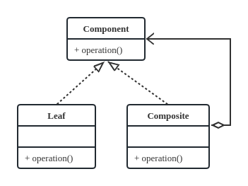

```java
//定义抽象构件接口
public interface Component {
    public void operation();
}
//定义树枝构件
public class Composite implements Component {
    // 构件容器
    private ArrayList<Component> componentList = new ArrayList<Component>();
    // 添加构件
    public void add(Component component) {
        this.componentList.add(component);
    }
    // 删除构件
    public void remove(Component component) {
        this.componentList.remove(component);
    }
    // 获取子构件
    public ArrayList<Component> getChild() {
        return this.componentList;
    }
    public void operation() {
        // 业务逻辑代码
    }
}
//定义叶子构件
public class Leaf implements Component {
    public void operation() {
        // 业务逻辑代码
    }
}
//使用
public class Client {
    public static void main(String args[]) {
        //创建一个根节点
        Composite root = new Composite();
        root.operation();
        //创建树枝节点
        Composite branch = new Composite();
        //创建叶子节点
        Leaf leaf = new Leaf();
        //构建树形结构
        root.add(branch);
        branch.add(leaf);
    }
    //遍历树（递归）
    public static void display(Composite root) {
        for (Component c : root.getChild()) {
            if (c instanceof Leaf) {//如果节点类型是叶子节点
                c.operation();
            } else {//树枝节点
                c.operation();
                display((Composite) c);//递归调用
            }
        }
    }
}
//private ArrayList<Component> componentList = new ArrayList<Component>();
//整个挺有趣，就是想象出一个格子本，每个格子空间都是Component，然后在整个格子里面自由地创建，画出一个树形图、或者奇怪的东西，DIY无疑了。
```

### 6.5 桥梁模式

> 将抽象和实现解耦，两个维度可以自己扩展，从而扩展更大的功能版图；实现扩展性、灵活性

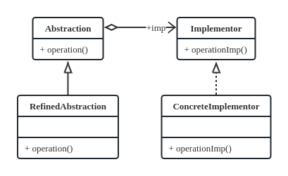

```java
//实现化角色
public interface Implementor {
    //方法的实现化声明
    public void operationImp();
}

//具体实现化角色
public class ConcreteImplementor implements Implementor {
    //方法的实现化实现
    public void operationImp() {
        // 业务处理代码
    }
}
//抽象化角色
public abstrac Abstraction {
    //定义对实现化角色的引用
    private Implementor imp;

    public Abstraction(Implementor imp) {
        this.imp = imp;
    }

    //业务方法
    public void operation() {
        //其他操作
        this.imp.operationImp();
    }
}

//修正抽象化角色
public class RefinedAbstraction extends Abstraction {
    public RefinedAbstraction(Implementor imp) {
        super(imp);
    }
    //修正父类的方法
    public void operation() {
        super.operation();
    }
}

//使用
public class Client {
    public static void main(String args[]) {
        // 定义一个实现化角色
        Implementor imp = new ConcreteImplementor();
        // 定义一个抽象化角色
        Abstraction abs = new RefinedAbstraction(imp);
        // 执行
        abs.operation();
    }
}
//使用场景：当抽象化角色和实现化角色有关系，而且不互相影响，就是抽象方和实现方二者可以单独变化而不受对方约束，桥梁模式主要就是将桥两边的抽象化角色和实现化角色整合成一个构件
```

### 6.6 外观模式

> 有多个子系统(子类)需要有一个代表(外观)来控制操作，然后如果要启动子系统(执行里面动作)就直接找代表就行

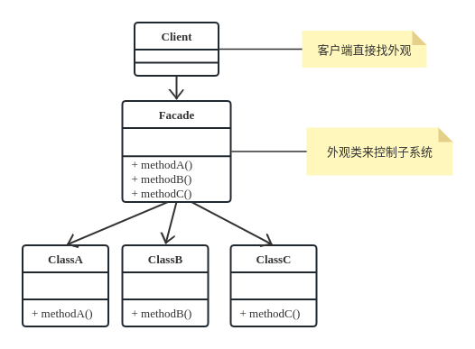

```java
public class Client {
    public static void main(String args[]) {
        // 定义一个外观角色
        Facade face = new Facade();
        // 执行
        face.methodA();
        face.methodB();
        face.methodC();
    }
}
public class Facade {//充当包装类角色
    //被委托的对象
    private ClassA a = new ClassA();  //也可以不用在这实例化的，和在外面一个道理
    private ClassB b = new ClassB();
    private ClassC c = new ClassC();

    //提供外界的方法
    public void methodA() {
        a.methodA();
    }
    public void methodB() {
        b.methodB();
    }
    public void methodC() {
        c.methodC();
    }
}
public class ClassA {
    public void methodA() {
        //A业务
    }
}
public class ClassB {
    public void methodB() {
        //B业务
    }
}
public class ClassC {
    public void methodC() {
        //C业务
    }
}
//应用：傻瓜相机一键操作，省去买菜洗菜炒菜做饭环节直接去饭店；就是为一堆复杂的模块提供一个接口一键操作
//内繁外简，简化操作，降低客户端和子系统的依赖，实现低耦合，黑箱操作
```

### 6.7 享元模式

> 元就是池子里面的，元是不重复的，可以复用的，比如五子棋盘上的黑白棋子

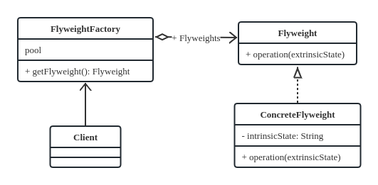

```java
public interface Flyweight {
    // 业务方法
    public abstract void operation(String extrinsicState);
}
public class ConcreteFlyweight implements Flyweight {
    private String intrinsicState;// 内部状态

    ConcreteFlyweight(String intrinsicState) {
        this.intrinsicState = intrinsicState;
    }
    @Override
    public void operation(String extrinsicState) {
        System.out.println("内部状态：" + intrinsicState
                + "，外部状态：" + extrinsicState);
    }
}
//享元工厂
public class FlyweightFactory {
    private static Map<String, Flyweight> pool = new HashMap<String, Flyweight>();

    private FlyweightFactory() {
    } // 私有构造方法

    public static Flyweight getFlyweight(String intrinsicState) {
        Flyweight flyweight = pool.get(intrinsicState);
        if (flyweight == null) {
            flyweight = new ConcreteFlyweight(intrinsicState);
            pool.put(intrinsicState, flyweight);
        }
        return flyweight;
    }
}
//仔细看上面代码意义就知道，享元工厂会去检查池子里面是否有那个对象，用内部状态判断，如果没有就创建，反之不创建。
//应用：五子棋盘，黑白棋就是两个元，这两个元对象在一个池子pool里面，使用时就复用这两个元对象，使用就是把它放在棋盘上，在外部添加坐标，规则等，从而组成一个棋盘
```

## 7. 行为型（11种）

> 对不同的对象之间划分责任和算法的抽象化  

### 7.1 模板方法模式

> 父类抽象类中有基本方法和模板方法，基本方法由子类继承实现，模板方法相当于封装核心处理，子类来扩展可变的部分，符合开闭原则

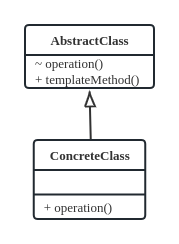

```java
public abstract class AbstractClass {
    //基本方法
    protected abstract void operation();
    //模板方法
    public void templateMethod() {
        //调用基本方法，完成相关的逻辑
        this.operation();
    }
}
public class ConcreteClass extends AbstractClass {
    // 实现基本业务方法
    protected void operation() {
        // 业务逻辑
    }
}
//使用
public class Client {
    public static void main(String args[]) {
        AbstractClass ac = new ConcreteClass();
        //调用模板方法
        ac.templateMethod();
    }
}
//多个具体类实现模板类，不同的实现抽象方法，从而让顶级逻辑的实现不同
```

### 7.2 命令模式

> 调用者类和实际执行者类没有关系，但是调用者类可以用那个命令接口的实现类作为媒介来命令控制实际执行者。  解耦和，其实意思就是调用类用一个命令类来让接受者干啥，然后这个命令类可以有多个，让多个实现子类实现命令接口就行

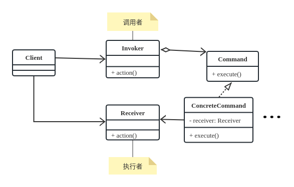

```java
public interface Command {
    //执行命令的方法
    public void execute();
}
public class ConcreteCommand implements Command {
    private Receiver receiver;
    public ConcreteCommand(Receiver receiver) {
        this.receiver = receiver;
    }
    // 执行方法
    public void execute() {
        this.receiver.action();
    }
}
public class Receiver {
    // 行动方法
    public void action() {
        System.out.println("执行动作");
    }
}
public class Invoker {
    private Command command;
    // 接收命令
    public void setCommand(Command command) {
        this.command = command;
    }
    //执行命令
    public void action() {
        this.command.execute();
    }
}
public class Client {
    public static void main(String args[]) {
        // 调用者
        Invoker invoker = new Invoker();
        // 接收者
        Receiver receiver = new Receiver();
        // 定义一个发送给接收者的命令
        Command command = new ConcreteCommand(receiver);
        // 执行
        invoker.setCommand(command);
        invoker.action();
    }
}
```

### 7.3 责任链模式

> 抽象处理者持有具体处理者的引用，多个具体处理者排成一条链，有序地排队处理，直到处理完成

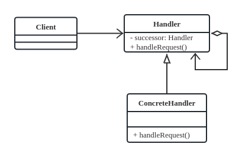

```java
public abstract class Handler {
    private Handler successor;
    //处理方法
    public abstract void handleRequest();
    public Handler getSuccessor() {
        return successor;
    }
    public void setSuccessor(Handler successor) {
        this.successor = successor;
    }
}
public class ConcreteHandler extends Handler {//注意，一般继承都可以有多个子类，意味着可以有多种处理方式
    // 处理请求
    public void handleRequest() {
        if (getSuccessor() != null) {
            System.out.println("请求传递给" + getSuccessor());
            getSuccessor().handleRequest();
        } else {
            System.out.println("请求处理");
        }
    }
}
public class Client {
    public static void main(String args[]) {
        Handler h1 = new ConcreteHandler();
        Handler h2 = new ConcreteHandler();
        h1.setSuccessor(h2);//将链子连接起来
        h1.handleRequest();//一直延伸到最后一个具体处理者
    }
}
//优点就是请求和处理分开，代理类把请求发送下去，处理的过程就不管了，直到返回结果
//缺点就是性能不太好
```

### 7.4 策略模式

> 抽象策略类和多个策略子类，每个策略子类都有各自的策略算法，这些策略还可以相互替换，实现了定义算法和使用算法分离

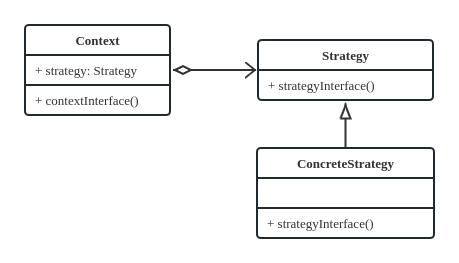

```java
//抽象策略类
public abstract class Strategy {
    //策略方法
    public abstract void strategyInterface();
}
//具体策略类
public class ConcreteStrategy extends Strategy {  //这里就可以实现多种策略然后在Context中处理
    // 实现策略方法
    public void strategyInterface() {
        // 具体算法
    }
}
//环境角色
public class Context {
    private Strategy strategy = null;
    //构造函数
    public Context(Strategy strategy) {
        this.strategy = strategy;
    }
    //调用策略方法
    public void contextInterface() {
        this.strategy.strategyInterface();
    }
}
//优点就是可以独立设计算法，用继承还可以复用父类的处理
//缺点就是上下文必须知道设计算法的不同区别
//常用在算法组选择，算法组切换
```

### 7.5 迭代器模式

> 创建一个对象来访问集合中元素，这个对象就是迭代器，可以说是一个工具类

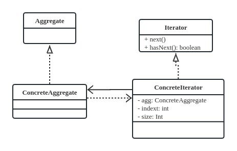

```java
public interface Iterator {
    public Object next();
    public boolean hasNext();
}
public class ConcreteIterator implements Iterator {
    private ConcreteAggregate agg;
    private int index = 0;
    private int size = 0;
    public ConcreteIterator(ConcreteAggregate agg) {
        this.agg = agg;
        size = agg.size();
        index = 0;
    }
    // 是否有下一个元素，即还没遍历结束
    public boolean hasNext() {
        return index < size;
    }
    //返回下一个元素
    public Object next() {
        if (index < size) {
            return agg.getElement(index++);
        } else {
            return null;
        }
    }
}

public interface Aggregate {
    public void add(Object obj);
    public Iterator creatIterator();
}
public class ConcreteAggregate implements Aggregate {
    private Vector vector = new Vector();
    public void add(Object object) {
        this.vector.add(object);
    }
    public Object getElement(int index) {
        if (index < vector.size()) {
            return vector.get(index);
        } else {
            return null;
        }
    }
    public int size() {
        return vector.size();
    }
    public Iterator creatIterator() {
        return new ConcreteIterator(this);
    }
}
public class ConcreteAggregate implements Aggregate {
    private Vector vector = new Vector();
    public void add(Object object) {
        this.vector.add(object);
    }
    public Object getElement(int index) {
        if (index < vector.size()) {
            return vector.get(index);
        } else {
            return null;
        }
    }
    public int size() {
        return vector.size();
    }
    public Iterator creatIterator() {
        return new ConcreteIterator(this);
    }
}
//就是一个遍历集合的类
```

### 7.6 中介模式


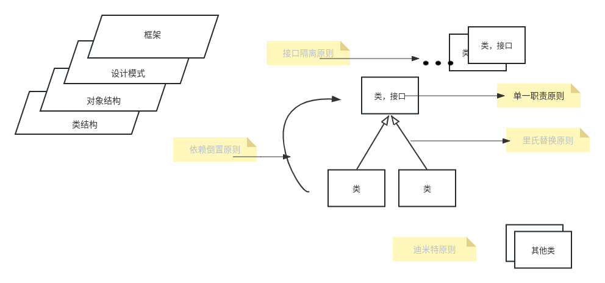


