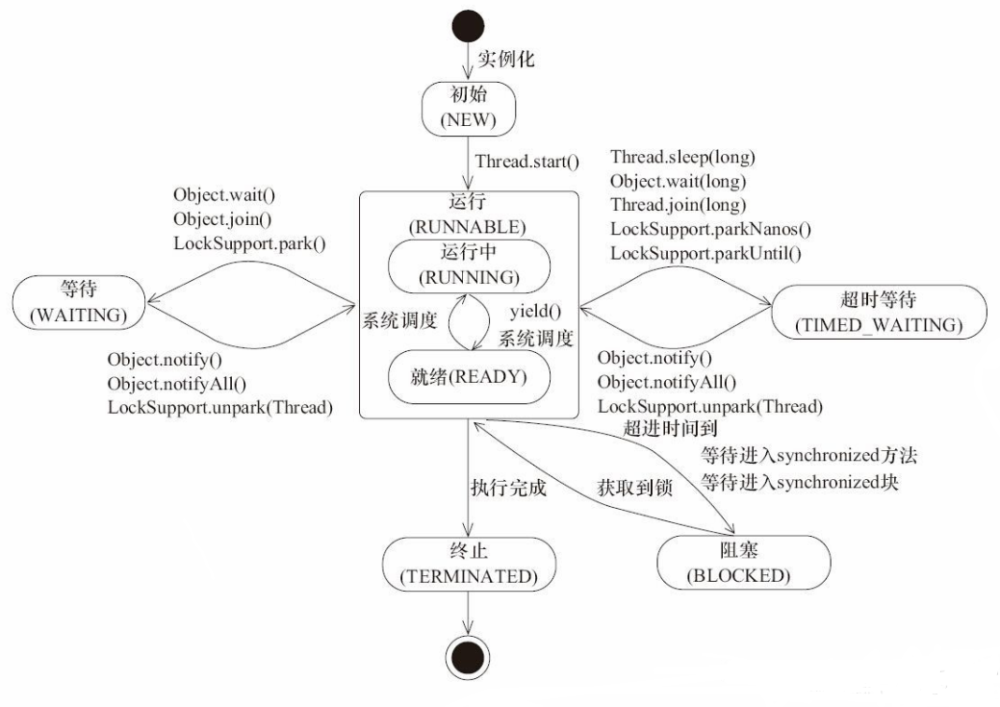
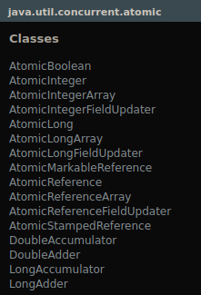
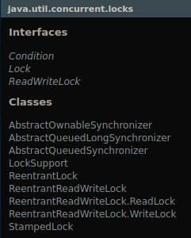
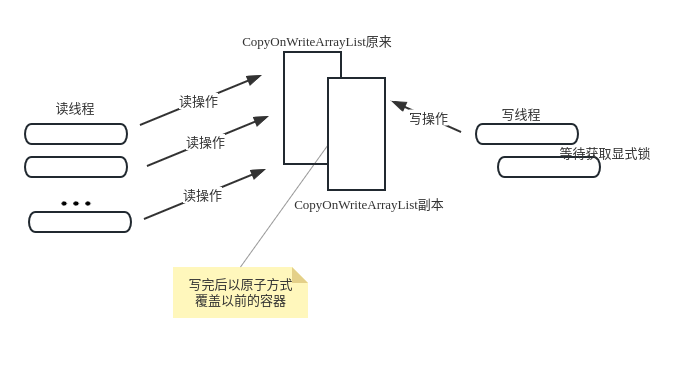

# 并发

> 这个并发吧，其实就是永远没有最优的解决方案，只有不断完善，不断升级，让人生更精彩，让世界更美好

- [并发](#并发)
  - [1. 线程](#1-线程)
    - [1.1 线程创建方式](#11-线程创建方式)
    - [1.2 线程产生问题](#12-线程产生问题)
    - [1.3 线程优点缺点](#13-线程优点缺点)
  - [2. 线程的竞争机制](#2-线程的竞争机制)
    - [2.1 锁的正确理解](#21-锁的正确理解)
    - [2.2 给容器加个锁](#22-给容器加个锁)
    - [2.3 加锁产生问题](#23-加锁产生问题)
  - [3. 线程的协作机制](#3-线程的协作机制)
    - [3.1 协作场景](#31-协作场景)
    - [3.2 wait()/notify()](#32-waitnotify)
    - [3.3 各场景实现](#33-各场景实现)
  - [4. 线程的中断](#4-线程的中断)
  - [5. 并发工具包](#5-并发工具包)
    - [5.1 原子变量和CAS](#51-原子变量和cas)
    - [5.2 显式锁](#52-显式锁)
    - [5.3 显式条件](#53-显式条件)
  - [6. 并发容器](#6-并发容器)
  - [7. 异步任务执行服务](#7-异步任务执行服务)
    - [7.1 实现原理](#71-实现原理)
    - [7.2 线程池](#72-线程池)
    - [7.3 定时任务](#73-定时任务)
  - [8. 线程同步协作工具](#8-线程同步协作工具)


## 1. 线程

> 首先并发是由线程数大于CPU数从而产生的，进程(主线程)是系统分配的基本单位，线程是CPU调度的基本单位，线程共享进程的堆和方法区(资源空间)；
>
> 线程状态：new创建--start就绪--runing系统调度运行--blocked阻塞--waiting等待--time_waiting时间--终止



### 1.1 线程创建方式

```java
 //1.继承Thread
 public class MyThread extends Thread {
     @Override
     public void run() {
         // 执行线程任务
     }
 }
     public static void main(String[] args) {
         // 创建线程
         MyThread thread = new MyThread();
         // 启动线程
         thread.start();//调用start后让操作系统创建线程并分配相关资源(单独的程序计数器和栈)以及调度
     }
 }
```

```java
 //2.实现接口 ，为什么要有这个，就因为单继承的原因，而且继承的耦合性高，可以说是单继承缺点的解决方式
 public class MyThread implements Runnable {
     @Override
     public void run() {
         // 执行线程任务
     }
     public static void main(String[] args) {
         Thread myThread = new Thread(new MyThread());
         System.out.println(myThread.getPriority());//线程优先级
         myThread.start();
         thread.join();//让调用join的main线程等待thread线程执行结束,原理是调用了主线程的wait让它等待
     }
 }
```

线程有一些基本属性和方法(可以自定义线程属性)，包括id、name、优先级、状态、设置线程是否daemo线程、sleep方法、yield方法、join方法、过时方法等，其实就是Thread类里面的方法，jdk文档很清楚。
使用这些方法的技巧就是知道这个方法的作用，以及这个方法是在Object里面，还是Thread的静态方法，
还是Thread的实例方法，知道这些就可以灵活操控了
deamo守护线程：如果main线程中创建了一个子线程并设置deamo为true，那主线程执行完后所以线程结束，如果不想主线程结束全部线程结束的话就不需要给子线程设置deamo为true

```java
//3.用FutureTask创建线程执行有返回值
public class CallerTask implements Callable<String> {
    @Override
    public String call() {
        return "hello";
    }
    public static void main(String[] args) throws InterruptedException {
        // 创建异步任务,这个任务会返回结果，不像上面两个似的只会做事情
        FutureTask<String> futureTask  = new FutureTask<>(new CallerTask());
        //启动线程
        new Thread(futureTask).start();
        try {
            //等待任务执行完毕，并返回结果
            String result = futureTask.get();
            System.out.println(result);
        } catch (ExecutionException e) {
            e.printStackTrace();
        }
    }
}
```

```java
//4.使用线程池创建线程，避免频繁创建销毁线程的开销
// 创建线程池
ExecutorService executor = Executors.newFixedThreadPool(10);
// 提交任务
executor.execute(new Runnable() {
    public void run() {
        // 执行线程任务
    }
});
// 关闭线程池
executor.shutdown();
```

```java
//补充：匿名内部类实现
Thread thread = new Thread(new Runnable() {
    public void run() {
        // 执行线程任务
    }
});
// 启动线程
thread.start();
```

### 1.2 线程产生问题

> 线程虽然提高了系统运行效率，但是在处理上面还是有缺点，避免了这两个缺点后线程就完美了

共享内存就是多个线程能访问同一个对象的属性和方法

- 缺点1      竞态条件：就是10000个线程对一个静态变量加1，结果变量值小于10000

  解决办法：synchronized、显示锁、原子变量

- 缺点2      内存可见性：一个线程对内存的修改另一个线程看不到；main线程修改了这个变量，但是子线程还是一直运行，并且一直往CPU寄存器或缓存中取放同一个值，就一直看不到不知晓main线程已经修改了

  解决办法：volatile关键字、synchronized关键字、显式锁同步

  这里加volatile后会发生什么呢？多个线程获取和设置这个值是直接和内存操作，不会用自己线程中的副本值

- 缺点3      线程间通信：多个线程需要协调完成某个任务时需要线程间的通信，这就得保证线程安全，避免出现数据不一致或者死锁

这些缺点都属于线程安全的问题：线程安全就是在多线程操作后，对共享数据或资源的访问、修改不会产生数据不一致或不在预期的情况

### 1.3 线程优点缺点

优点就是能充分利用CPU内存磁盘网络资源，在某些业务上使用线程也能优化用户体验，提高应用细节功能

缺点除了上面两个还有就是线程创建，调度，上下文切换都消耗系统资源；操作系统会为线程创建栈和程序计数器，调度和上下文切换会不断恢复删除CPU寄存器中的值，很可能导致缓存值失效。  为甚后面的缺点不放在上面列出，因为这是硬件层面的问题，解决不了，只能预防，反正就是线程这个功能你爱用不用，用就有好处，但是你得解决出现的问题，不用就老老实实地用主线程，而且多线程调试挺困难，不用就少麻烦事做

这里考虑创建线程数量时得考虑时CPU密集型还是IO密集型，因为见过项目里面处理大量数据就只有一个线程处理数据

## 2. 线程的竞争机制

> 线程的竞争机制就是为了解决线程的竞态条件和内存可见性问题

### 2.1 锁的正确理解

synchronized修饰实例方法：一个类中实例方法用这个后，同时只能有一个线程调用这个方法，别的线程调用就得先或得锁，如果获取不了就在等待队列中等待；创建的一个对象里面只要有这个关键字的方法就不能同时执行，但是创建两个对象，两个对象就可以同时执行，两个对象是分开的。 关键字保护的是对象，让每个对象都有一个锁和等待队列。synchronized可以同步任何对象，任何对象都有锁和等待队列

synchronized修饰静态方法：和上面同理，只是这个锁保护的是类对象

注：如果这个对象中有一个方法没用这个关键字，则另一个线程可以同步使用这个方法，所以在保护变量的时候，需要在所以访问该变量的方法上加synchronized

总结就是synchronized保护实例对象里面有这个关键字的方法或代码块

synchronized修饰代码块其实就是上面两个的意思，一个用synchronized(this)，一个用synchronized(Xxx.class)，也可以随便用对象，synchronized(new Object()),括号里面的对象有一个锁和等待队列。括号里面就是要保护的对象

```java
 public class Counter {
     private int count;
     public synchronized void incr() {
         count++;
     }
     public synchronized int getCount() {
         return count;
     }
 }
 //上面其实就是下面这个
 public class Counter {
     private int count;
     public void incr() {
         synchronized (this) {
             count++;
         }
     }
     public int getCount() {
         synchronized (this) {
             return count;
         }
     }
 }
 //使用锁对象
 public class Counter {
     private int count;
     private Object lock = new Object();
     public void incr() {
         synchronized (lock) {//去拿Object对象锁
             count++;
         }
     }
     public int getCount() {
         synchronized (lock) {
             return count;
         }
     }
 }
 public class CounterThread extends Thread {//使用
     Counter counter;
     public CounterThread(Counter counter) {
         this.counter = counter;
     }
     @Override
     public void run() {
         for (int i = 0; i < 1000; i++) {
             counter.incr();
         }
     }
     public static void main(String[] args) throws InterruptedException {
         int num = 1000;
         Counter counter = new Counter();
         Thread[] threads = new Thread[num];
         for (int i = 0; i < num; i++) {
             threads[i] = new CounterThread(counter);
             threads[i].start();
         }
         for (int i = 0; i < num; i++) {
             threads[i].join();
         }
         System.out.println(counter.getCount());
     }
 }
```

线程的竞争机制里面的一些问题点

- 可重入性：线程获取对象锁之后可以调用对象中其它被同步的方法
- 内存可见性：synchronized可以实现原子操作，在方法上用关键字，而且还能保证内存可见性，线程获得锁后去内存拿值，释放锁后值写回内存。    用这个实现原子操作成本太高，变量用volatile好，操作系统会给变量加特殊指令

- 同步容器：下面这个

### 2.2 给容器加个锁

```java
//同步容器：就是实现了collection接口的同步容器类，里面和collection差不多，只是每个方法里面使用了
//synchronized关键字修饰一个Object对象给容器加锁；但是同步容器会出现问题，比如下面的问题
  
// 复合操作
//这个类中的map是线程安全的，但是putIfAbsent方法不是；如果多个线程执行到if(old!=null)这都得到true，
//那都会调用put方法，这就有点不正常了
     public class EnhancedMap<K, V> {
     Map<K, V> map;
     public EnhancedMap(Map<K, V> map) {
         this.map = Collections.synchronizedMap(map);
     }
     public V putIfAbsent(K key, V value) {
         V old = map.get(key);
         if (old ! = null){
             return old;
         }
         return map.put(key, value);
     }
     public V put(K key, V value) {
         return map.put(key, value);
     }
 }
 
 //伪同步  就是同步错了，就像下面这样，正确的应该同步map对象
 public synchronized V putIfAbsent(K key, V value) {
      V old = map.get(key);
       if (old != null) {
           return old;
        }
       return map.put(key, value);
 }
 //解决伪同步
  public V putIfAbsent(K key, V value) {
         synchronized (map) {
             V old = map.get(key);
             if (old ! = null){
                 return old;
             }
             return map.put(key, value);
         }
     }
//迭代   就是两个线程对同步容器一个修改，一个遍历；结果就是遍历的会产生异常，因为遍历容器时容器
//结构发生变化就会抛出异常，解决办法就是在遍历的时候对同步容器加锁
 
//所以并发容器问题还是挺多的，性能也低，但是Java还有别的性能高的并发容器        有待深入研究
//CopyOnWriteArrayList
//ConcurrentHashMap
//ConcurrentLinkedQueue
//ConcurrentSkipListSet
```

### 2.3 加锁产生问题

> 开销：线程获取不到锁会从用户态切换到内核态阻塞等待，这过程很耗时，而且线程的上下文切换调度开销也大
>
> 死锁：线程相互都持有锁，但还是去获取对方的锁，就会造成死锁
>
> 避免死锁：银行加算法，两个线程相同顺序获取两个锁，这样一个线程得不到也会自动获取下一个资源

死锁四条件：

- 互斥条件：A线程想要获取B线程持有的锁是获取不到的，只能等待
- 请求并持有：B线程拥有了一个锁后获取不到别的锁从而等待
- 不可剥夺：每个线程获取锁后只有执行完后才会主动释放锁，自己的锁不会被别的线程抢走
- 环路等待：A线程获取B线程的锁，B线程获取C线程的锁，C线程获取A线程的锁，中间还可以更多，不过没哪个项目里面有这么多，出发处理太过复杂，不小心环路等待了

显式锁就是对象的锁带有时间限制，得不到锁就释放当前拥有的锁，避免死锁-------这个点先放着，后面解决

## 3. 线程的协作机制

> 线程产生的竞态、内存可见性问题用上面竞争机制处理；线程也有更厉害的用法，就是妙用wait()/notify()

### 3.1 协作场景

1. 生产者消费者协作模式 —— 生产者往队列中放数据，消费者往队列中取数据，队列空了后消费者停，队列满了生产者停，这个停就是用wait()/notify()或其他来操作线程实现
2. 同时开始 —— 使用某种方式让多个线程一起开始运行
3. 等待结束(主从协作) —— 主任务必须等待子任务结束后才能结束
4. 异步结果 —— 这个现在有点理解不了，好像跟Future返回结果有关
5. 集合点 —— 多个线程都处理到一定程度后在某个地方等待着做一件事，交换数据结果啥的，然后再各自处理各自的

### 3.2 wait()/notify()

分清锁、等待队列、条件队列的区别：锁就是synchronized保护机制，等待队列就是线程执行synchronized方法首先得获取对象的锁，如果获取不了自身进入等待队列中；条件队列是线程执行wait方法后进入条件队列阻塞

> 注意wait方法执行会释放之前synchronized获取的锁，如果线程获取了两个锁，就是sync里面还有一个sync，但是wait只会释放一个锁，这时候注意释放的是那个对象的锁，所以会有一个锁没释放，这时别的线程在获取这个锁会获取不到，就会阻塞；调用哪个对象的wait就在哪个对象的等待队列中，然后释放该对象的锁

wait()/notify()的使用与原理：首先使用wait和notify的那一块得用synchronized同步(这是必须的)，因为wait后会释放锁，如果不同步哪来的锁释放； wait执行后让线程进入条件队列等待，然后等待时间结束或者notify通知就可以出去了，或者别的线程调用了本线程的interrupt()方法让本线程抛出异常，但是wait等待的不止notify，还有锁和协作变量的改变；

```java
public class Main extends Thread {
        private volatile boolean fire = false;
        @Override
        public void run() {
            System.out.println("前");
            try {
                synchronized (this) {
                    System.out.println("会不会有两次");//答案是不会，因为虽然wait从条件队列中出来后会获取锁和判断变量，但不会继续执行这个，这个思想很有特点，想想它的处理就知道了
                    while(! fire) {//防止“虚假唤醒”，就是没发生notify通知、等待时间到、抛出异常，但是线程莫名被唤醒
                        //这样即使被虚假唤醒后由于上面的判断，也会继续wait
                        wait();
                    }
                }
                System.out.println("fired");
            } catch(InterruptedException e) {
            }
            System.out.println("后");
        }
        public synchronized void fire() {
            System.out.println("notify得到锁");
            this.fire = true; //这个点很有意思，当把这注了后会继续让线程进入条件队列中，
            			//fired和同步后两个不会打印； 注了后线程继续保持在条件队列中，程序还在处于运行状态
            notify();//别的线程调用本对象的notify方法来将条件队列中等待的线程唤醒，只会唤醒这个对象中一个线程
            System.out.println("notify释放锁");
        }
        public static void main(String[] args) throws InterruptedException {
            Main waitThread = new Main();
            waitThread.start();
            Thread.sleep(3000);
            System.out.println("fire");
            waitThread.fire();
        }
}
//结果
前
fire
notify得到锁
notify释放锁
fired
后
    
//函数区别  官方说了wait后中断和虚假唤醒是可能的，所以最好搭配协作变量
wait(long timeout)//时间到线程自动唤醒，如果参数为负数则抛出异常
wait(long timeout, int nanos)//wait(0,0)和wait(0)一样，nanos的作用就是让wait时间多1
```

最后补充一下sleep和yield的使用区别：sleep让当前线程状态变为TIME_WITING，然后不释放锁，等时间结束就继续执行；但是yield是线程主动让出CPU时间片，然后回到就绪状态等待运行

### 3.3 各场景实现

1. 生产者消费者模式 —— 有生产者线程类、消费者线程类、消息队列类；然后生产者线程调用队列类里面的put方法，如果判断出队列类中满了就调用wait()，然后当前生产者线程就进入条件队列中，并且释放锁；这时消费者拿到锁去调用take方法取消息，如果判断出队列类中空了就调用wait，自己这个线程也进入条件队列中，调用notifyAll()将条件队列中的生产者线程通知出来，然后生产者就又能放消息了；其实想想这个流程里面两方生产和消费的执行间隔次数是不固定的，由操作系统分配，但是能完美地实现消息队列的使用

更多的还是使用下面java已有的阻塞队列来给线程操作

接口BlockingQueue和BlockingDeque；基于数组的实现类ArrayBlockingQueue；<br>基于链表的实现类LinkedBlockingQueue和LinkedBlockingDeque；基于堆的实现类PriorityBlockingQueue；

```java
class Producer implements Runnable {//生产者
    private LinkedList<Integer> buffer;
    private int maxSize;

    public Producer(LinkedList<Integer> buffer, int maxSize) {
        this.buffer = buffer;
        this.maxSize = maxSize;
    }

    public void run() {
        while (true) {
            synchronized (buffer) {
                while (buffer.size() == maxSize) {
                    try {
                        System.out.println("Buffer is full, waiting for consumer to consume...");
                        buffer.wait();//如果满就让线程在buffer对象的条件队列中等待并释放锁
                    } catch (InterruptedException e) {
                        e.printStackTrace();
                    }
                }
                int item = (int) (Math.random() * 100);
                buffer.add(item);
                System.out.println("Produced item: " + item);
                buffer.notifyAll();
            }
        }
    }
}
class Consumer implements Runnable {//消费者
    private LinkedList<Integer> buffer;
    private int maxSize;

    public Consumer(LinkedList<Integer> buffer, int maxSize) {
        this.buffer = buffer;
        this.maxSize = maxSize;
    }

    public void run() {
        while (true) {
            synchronized (buffer) {
                while (buffer.isEmpty()) {
                    try {
                        System.out.println("Buffer is empty, waiting for producer to produce...");
                        buffer.wait();//如果空就让线程在buffer对象的条件队列中等待并释放锁
                    } catch (InterruptedException e) {
                        e.printStackTrace();
                    }
                }
                int item = buffer.removeFirst();
                System.out.println("Consumed item: " + item);
                buffer.notifyAll();
            }
        }
    }
}
public class ProducerConsumerExample {
    public static void main(String[] args) {
        LinkedList<Integer> buffer = new LinkedList<>();//模拟队列放数据和取数据
        int maxSize = 10;
        Thread producerThread = new Thread(new Producer(buffer, maxSize));
        Thread consumerThread = new Thread(new Consumer(buffer, maxSize));
        producerThread.start();
        consumerThread.start();
    }
}

```

同时开始 —— 多个子线程去调用准备方法来把自己放进条件队列中等待，然后释放锁，等全部子线程都进入条件队列中等待好后，主线程sleap一段时间，然后主线程获取锁去调用开始方法，开始方法中有notifyall方法来唤醒全部子线程，这些子线程就各自把自己从wait后续的操作

等待结束 —— 和同时开始相反，这个是用一个共享变量来控制，多个子线程执行对象方法来给这个变量减一，当变量等于0后调用notifyAll来通知主线程，为什么通知主线程，因为这是等待结束啊，子线程执行完后通知主线程可以结束了

异步调用 —— 好像就是封装线程处理返回处理结果,这里搞不太懂，先放着☆☆☆后面搞懂了，就是Feature那个东西

集合点 —— 用一个和线程数相同的共享变量来控制，每个线程进入wait前减一，如果减到0之后就notifyall,其实还是灵活运用wait和notify

## 4. 线程的中断

> 为甚要有线程中断，因为看看上面的操作，比如生产者消费者是一直循环运行着的，或者一直在条件队列中，反正都是处于运行中，如果想要停止他们，就得中断线程；还有其他的目的，一些线程业务上，例如多个线程做一个任务，其中一个线程处理完成，就得把其他线程中断停掉
>
> 记住线程中断不是强制停止线程，只是给线程一个信号，停止还得看线程状态自己处理

线程Thread有三个方法isInterrupted()、interrupte()、静态方法interrupted()

```java
public boolean isInterrupted()
public void interrupt()
public static boolean interrupted()
```

-  isInterrupted()返回当前线程的中断标志位是否为true
- interrupt()中断当前线程，其实这个不是直接中断，懂吧，它只是设置线程的中断标志位true/false，然后另外两个方法得到线程的中断标志位来做某样处理，让线程退出来；记住不是真正退出
- 静态方法interrupted()返回当前线程中断标志位是否为true，和上上面那个差不多，但是这个连续两次调用后，第二次会清除标志位从而返回false

```java
public class ThreadInterruptExample {
    public static void main(String[] args) throws InterruptedException {
        Thread thread = new Thread(new MyRunnable());
        thread.start();
        Thread.sleep(1000);
        thread.interrupt();//线程中断，但是如果线程正在IO操作、sleep、wait时会清空中断标志位并抛出异常
    }
}

class MyRunnable implements Runnable {
    public void run() {
        try {
            while (!Thread.currentThread().isInterrupted()) {//不断循环并判断线程中断标志位状态
                System.out.println("Running...");
                Thread.sleep(500);
            }
        } catch (InterruptedException e) {
            System.out.println("Interrupted");
        }
    }
}
```

interrupt()方法不会让线程显式中断，它只是隐式地将中断位改变，记住这点！！但是使用它的时候在线程不同状态时发生的事情也不同，比如

- RUNNABLE	这时候只会设置中断标志位为true，它没有什么用，但是可以在线程运行时检查这个标志位来判断是否做某事，这样就可以在运行时用Thread().currentThread().isInterrupted()判断是否继续处理
- TIME_WAITING/WAITING    这时候会在调用对应wait()处抛出异常InterruptedException，也没什么用，但是也相当于中断了，但是这时候中断标志位会被清除；可以利用抛出异常这个机制，捕获异常来rerurn或其他处理，比如在catch中设置做个什么处理
- BLOCKED    这时候只会设置中断标志位为true，也没什么用，也不会线程从等待队列中弄出来啥的，但是它会设置中断标志位啊
- NEW/TERMINATE    这时候不会有作用，什么都不会发生

> 说到底Thread里面的中断方法只能设置标志位，不能真正中断线程，可以使用这个机制来做其他操作，想要中断线程还得封装中断方法，比如使用Future和ExecutorService里面的cancel(),shutdown()方法来取消任务执行

## 5. 并发工具包

> java.util.concurrent.atomic高性能并发工具包，为甚高性能，就是因为里面封装volatile进行操作
>
> 比如只想同步一个变量就没必要使用锁，直接用这个原子变量
>
> 它的出现替换了synchronized，避免了取锁和放锁上下文切换，线程阻塞等，减少系统开销；高并发专用
>
> 使用时看看源码，上面说得很清楚，先懂它的用法和实现原理

### 5.1 原子变量和CAS



上面包里面的类就是可以以原子的方式来更新Integer、数组类型、引用类型、引用里面的字段等；轻量级操作有大作用，用来很安全地以原子方式更新值；比直接用synchronized和volatile更好更方便

```java
    public static void main(String[] args) {
        AtomicInteger atomicInteger = new AtomicInteger();
        for (int i = 0; i < 10000; i++) {
            new Thread(atomicInteger::incrementAndGet).start();
        }
        System.out.println(atomicInteger.get());
    }//10000   线程拿到的永远是更新完成后的值
```

例如AtomicInteger类里面源码：由于现在硬件层次上的支持，可以直接以硬件的CPU提供的CAS（Compare-and-Swap）方式来操作变量，原子操作更轻量级；属于乐观非阻塞，性能高效

```java

private volatile int value;//原子机制就是用这个保存内存可见性
private static final Unsafe unsafe = Unsafe.getUnsafe();//硬件层面的操作
public final boolean compareAndSet(int expect, int update) {//先比较再更新
    return unsafe.compareAndSwapInt(this, valueOffset, expect, update);
}//之前只有这个方法是调底层的，这个类中一些其他方法都基于这个；
//但是现在少调用了，好多方法都支持调底层，但我想CAS虽然是这个，但也代表所以的调用底层的方法吧？
//我觉得其实就是一个思想
/**
* Atomically increments by one the current value.
*
* @return the previous value
*/
public final int getAndIncrement() {
   return unsafe.getAndAddInt(this, valueOffset, 1);
}
get()：获取当前值。
set(int newValue)：设置新值。
getAndSet(int newValue)：获取当前值并设置新值。
compareAndSet(int expect, int update)：如果当前值等于expect，则设置为update。
incrementAndGet()：先自增1，再获取当前值。
addAndGet(int delta)：先增加delta，再获取当前值。
```

虽然看起来这个功能少，只能操作里面的一个变量，但是由于这个是原子操作，也可以用这个实现一个乐观非阻塞锁

```java
public class MyLock {
    private AtomicInteger status = new AtomicInteger(0);//0表示没锁定，1表示锁定
    public void lock() {
        while(status.compareAndSet(0, 1)) {
            Thread.yield();
        }
    }
    public void unlock() {
        status.compareAndSet(1, 0);
    }
}//之后就可以在线程执行中用这个类来实现锁，而且还不阻塞，高效一点
```

最后有个ABA的问题，虽然这个原子操作很棒，但是忽略了ABA的问题，就是它识别不了值被更改过，只是知道最后拿到的值是正确的，和之前值是一样的；解决办法只能再比较一个时间戳

```java
//用这个原子包中的AtomicStampedReference类里面的这个方法
    public boolean compareAndSet(V   expectedReference,
                                 V   newReference,
                                 int expectedStamp,
                                 int newStamp) {
        Pair<V> current = pair;
        return
            expectedReference == current.reference &&
            expectedStamp == current.stamp &&
            ((newReference == current.reference &&
              newStamp == current.stamp) ||
             casPair(current, Pair.of(newReference, newStamp)));
    }
```

> 总结：想安全使用计数，反正就是安全改变值就用原子变量；这个高效，乐观，非阻塞，高并发的最爱
>
> 其实就是为了解决线程竞态条件问题，然后CAS是一个实现机制，但是最根本的还是volatile和unsafe操作

### 5.2 显式锁

> 首先显示锁是为了解决synchronized使用的局限性，更灵活，可以说是synchronized的替代方案



Lock接口中定义了一些方法lock()/unLock()、tryLock()等，具体实现在ReentrantLock里面

- lock()unLock()：获取锁/释放锁，获取不了就一直阻塞直到获取到
- tryLock()：返回boolean，只有当锁在调用时是空闲的，才会获取锁

- lockinterruptibly()：获取锁，除非当前线程被中断
- tryLock(long time, TimeUnit unit)：返回boolean，如果锁在给定的等待时间内空闲且当前线程未被中断，则获取锁
- newcondition()：返回一个绑定到此Lock实例的新Condition实例

ReentrantLock里面使用了CAS操作，也使用了AQS，线程的状态切换用的是LockSupport里面的pack那些方法，三个东西搭配操作实现这个并发工具类；看源码里就是ReentrantLock里实现确实实现了Lock里面的方法，但是实际还是使用AQS具体实现;然后呢，就是AQS里面使用了LockSupport来实现线程的状态切换，而且自身维护了一个等待队列来放线程

```java
//ReentrantLock有两个构造方法，其中一个选择是否公平，默认不公平，由于现在优化得挺好的，所以继续默认不公平，就像人生一样，看似公平，实则还得看环境与个人
//ReentrantLock里面的内部类
abstract static class Sync extends AbstractQueuedSynchronizer//AQS
static final class NonfairSync extends Sync//不公平锁,默认不公平锁
static final class FairSync extends //Sync公平锁

public void lock() {
        sync.lock();
}
```

```java
//例子，它其实就是个工具包，封装了一些有用的特性而已
public class Counter {
    private final Lock lock = new ReentrantLock();
    private volatile int count;
    public void incr() {
        lock.lock();//其实最好用tryLock()，这样避免锁在被别的线程持有，防止了死锁
        try {
            count++;
        } finally {
            lock.unlock();
        }
    }
    public int getCount() {
        return count;
    }
}
```

> 其实可以在这说明一下LockSuport里面方法的具体含义的，但是这个由AQS封装使用，没在显式锁出现，就先放着，等后面复盘时再仔细深入
>
> 总结就是这里包中的接口和类主要就是比synchronized功能多，高效一点，能限时，能返回true/false，可程序地自由命令控制线程。这里还多了个AQS的东西，显式锁就是CAS和AQS和LockSuport搭配操作

### 5.3 显式条件

解决竞态条件    ---   实现协作机制

synchronized  ----  wait()/notify()

显式锁       -----         显式条件await()/signal()

显式条件的使用其实和wait()/notify()一样，也是让线程进入条件队列中，释放锁，释放CPU；当被唤醒后或时间到或发生中断重新获取锁再继续处理后面的任务；注意这里最好也使用一个等待条件，就像上面的wait前面的判断，防止“虚假唤醒”

显式锁搭配显式条件使用

```java
public class WaitThread extends Thread {
    private volatile boolean fire = false;
    private Lock lock = new ReentrantLock();
    private Condition condition = lock.newCondition();
    @Override
    public void run() {
        try {
            lock.lock();
            try {
                while (!fire) {
                    condition.await();//让这些线程进入这个显式条件的条件队列中等待，并释放锁
                }
            } finally {
                lock.unlock();
            }
            System.out.println("fired");
        } catch (InterruptedException e) {
            Thread.interrupted();
        }
    }
    public void fire() {
        lock.lock();
        try {
            this.fire = true;
            condition.signal();//注意这里别用notify()
        } finally {
            lock.unlock();
        }
    }
    public static void main(String[] args) throws InterruptedException {
        WaitThread waitThread = new WaitThread();
        waitThread.start();
        Thread.sleep(1000);
        System.out.println("fire");
        waitThread.fire();
    }
}//之前的生产者消费者模式就可以用这个显式锁和显式条件改进，用显式锁创建两个显式条件，
//一个条件队列专门放生产者线程，另一个条件队列专门放消费者线程
```

> 总结就是这个显式条件就是专门和显式锁搭配使用，这样可以使用多个条件队列；然后其实显式锁还是显式条件的实际操作和功能主要是靠AQS来实现

## 6. 并发容器

1. **写时复制容器**



其实这个写容器和正常List容器差不多，它同样也是实现List接口，但是这个里面它将容器的引用设置为volatile，每次获取引用就得到这个引用指向的容器空间，但是写的时候会联合显式锁ReentrantLock来给写操作加锁；所以这个写时复制适合并发读情况，写少的情况，而且如果容器体积太大也不合适，因为它写的时候是在容器副本上面写，这个容器副本得copy一份，体积太大性能有影响

```java
public class CopyOnWriteArrayList<E>
    implements List<E>, RandomAccess, Cloneable, java.io.Serializable {    
/** The array, accessed only via getArray/setArray. */
    private transient volatile Object[] array;//原子引用

    /**
     * Gets the array.  Non-private so as to also be accessible
     * from CopyOnWriteArraySet class.
     */
    final Object[] getArray() {
        return array;
    }
    public E set(int index, E element) {//和public boolean add(E e) {差不多的机制
        final ReentrantLock lock = this.lock;//写使用了显式锁，读不加锁，所以读支持高并发
        lock.lock();
        try {
            Object[] elements = getArray();
            E oldValue = get(elements, index);

            if (oldValue != element) {
                int len = elements.length;
                Object[] newElements = Arrays.copyOf(elements, len);//复制一份来进行操作
                newElements[index] = element;
                setArray(newElements);
            } else {
                // Not quite a no-op; ensures volatile write semantics
                setArray(elements);
            }
            return oldValue;
        } finally {
            lock.unlock();
        }
    }
```

> 其实还有个CopyOnWriteArraySet，但它是在CopyOnWriteArrayList的基础上操作的，差不多，而且性能低
>
> 总结就是写时复制容器适合读并发，写少，容器体积不大的场景，它是一种保证线程安全的思维

2. **并发HashMap**

并发HashMap就是并发工具包中的ConcurrentHashMap，和上面两个容器一样支持高并发读，内部有很多原子操作；和以前老式同步容器相比这个不用在迭代时候加锁；而且这个不会出现死循环问题，HashMap会；

这个ConcurrentHashMap的这些优点是由分段锁实现的，将容器看成一条链，然后分为很多段，然后每个段都有各自的锁，这个锁是给写操作用的，读不需要锁；意思就是ConcurrentHashMap可以读并行，写的同时可以读，但是写不能并行，需要获取锁。

这个分段锁的源码优点复杂，有时间再仔细研究

注意！这个ConcurrentHashMap的迭代有个**弱一致性问题**，就是如果对这个ConcurrentHashMap进行遍历，在遍历之后对遍历过的数据进行修改，这是不会遍历出修改值的，但是修改值在遍历之前就可以反应出来这个值。时间差和分段锁机制导致的

3. **跳表Map和Set**

基于哈希的可排序的跳表Map和Set，就是ConcurrentSkipListMap和ConcurrentSkipListSet；TreeSet基于TreeMap实现，ConcurrentSkipListSet也是基于ConcurrentSkipListMap实现。

> 总结就是ConcurrentSkipListMap和ConcurrentSkipListSet基于跳表实现，有序，无锁非阻塞，读和写都完全并行，主要操作复杂度为O(log(N))。

4. **并发队列**

- 无锁非阻塞并发队列：ConcurrentLinkedQueue(单向链表)和ConcurrentLinkedDeque(双端队列/双向链表)

  多线程操作它不需要获取锁，故而不会线程阻塞，这是由CAS实现的

- 普通阻塞队列：基于数组的ArrayBlockingQueue，基于链表的LinkedBlockingQueue和LinkedBlockingDeque

  常用于生产者消费者模式，内部由显式锁ReentrantLock和显式条件Condition实现

  ```java
  //入队，如果队列满，等待直到队列有空间
  void put(E e) throws InterruptedException;
  //出队，如果队列空，等待直到队列不为空，返回头部元素
  E take() throws InterruptedException;
  //入队，如果队列满，最多等待指定的时间，如果超时还是满，返回false
  boolean offer(E e, long timeout, TimeUnit unit) throws InterruptedException;
  //出队，如果队列空，最多等待指定的时间，如果超时还是空，返回null
  E poll(long timeout, TimeUnit unit) throws InterruptedException;
  ```

- 优先级阻塞队列：PriorityBlockingQueue

  这个和普通阻塞队列不一样的是这个出是按照优先级高的先出；内部由堆实现，也用了显式锁ReentrantLock和条件

- 延时阻塞队列：DelayQueue

  延时是由于里面每个元素要求实现Dlayed接口，让里面的每个元素有个时间属性并可以比较，这样当时间过了后就说明元素延迟到了，可以出队给线程使用了，不然线程还在阻塞等待；内部也是用显式锁ReentrantLock和条件实现，多用于实现定时任务

- 其他阻塞队列：SynchronousQueue和LinkedTransferQueue

## 7. 异步任务执行服务

> 从前面的代码看来，有点过于关注线程任务的执行了，这样挺累的，还得看线程的创建，调度，结束等细节；所以这时候就得再高一级地看待这个问题，从一个管理者的角度来处理线程，只关注开始任务、任务结果、关闭任务，这样就轻松多了，站在全局统筹线程们执行任务；执行服务封装了线程执行细节

### 7.1 实现原理

> 实现原理就是这几个接口的使用

Runnable和Callable的区别：

```java
public interface Runnable {//没有返回结果，也不会抛出异常，只会线程处理
    public abstract void run();
}
public interface Callable<V> {//有返回结果、可以抛出异常
    V call() throws Exception;
}
```

Executor接口中只有一个方法：

```java
//在将来的某个时间执行给定的命令。该命令可以在新线程、池线程或调用线程中执行，由Executor实现自行决定
//没有返回结果
void execute(Runnable command);
```

ExecutorService接口中的方法：

```java
void shutdown();//停止接受新任务，已经提交的任务继续执行,不会阻塞等待
List<Runnable> shutdownNow();//停止接受新任务和终止已经提交但未执行的任务，中断正在执行的任务，不会阻塞等待
boolean isShutdown();//上面两个其中一个执行了这个就会返回true
boolean isTerminated();//等待任务全部结束后返回true
boolean awaitTermination(long timeout, TimeUnit unit) throws InterruptedException;//等待任务结束
<T> Future<T> submit(Callable<T> task);//提交Callable任务，不代表立马执行，有返回值
<T> Future<T> submit(Runnable task, T result);//提交Runnable任务，第二个参数是为了任务结束后返回值
Future<?> submit(Runnable task);//提交Runnable任务，返回值为null
<T> List<Future<T>> invokeAll(Collection<? extends Callable<T>> tasks)//批量提交任务
<T> List<Future<T>> invokeAll(Collection<? extends Callable<T>> tasks,
                                  long timeout, TimeUnit unit)//时间到任务没结束的会被取消
<T> T invokeAny(Collection<? extends Callable<T>> tasks)//其中一个任务返回结果后这个就返回结果
<T> T invokeAny(Collection<? extends Callable<T>> tasks,
                    long timeout, TimeUnit unit)//限时等待返回其中一个任务结果，
```

Feature返回结果

```java
public interface Future<V> {
    boolean cancel(boolean mayInterruptIfRunning);//cancel作用之后返true，任务完成或已经取消返false
    boolean isCancelled();//查询任务是否被取消，cancel是true这个也是true
    boolean isDone();//查询任务是否已经完成
    V get() throws InterruptedException, ExecutionException;//返回任务结果，线程运行中就继续阻塞
    V get(long timeout, TimeUnit unit)//返回任务结果，未完成继续阻塞，可以指定任阻塞时间
        throws InterruptedException, ExecutionException, TimeoutException;
}
```

ExecutorService的基本用法：

```java
public class BasicDemo {
    static class Task implements Callable<Integer> {//任务
        @Override
        public Integer call() throws Exception {
            int sleepSeconds = new Random().nextInt(1000);
            Thread.sleep(sleepSeconds);
            return sleepSeconds;
        }
    }
    public static void main(String[] args) throws InterruptedException {
        //使用一个线程来执行服务
        ExecutorService executor = Executors.newSingleThreadExecutor();//工厂方法模式创建单线程
        Future<Integer> future = executor.submit(new Task());//提交任务执行
        //模拟执行其他任务
        Thread.sleep(100);
        try {
            System.out.println(future.get());
        } catch (ExecutionException e) {
            e.printStackTrace();
        }
        executor.shutdown();//关闭任务执行服务
    }
}
```

源码基本思想就是ExecutorService的抽象实现类AbstractExecutorService具体实现了ExecutorService接口中的方法；

```java
//AbstractExecutorService.java
public <T> Future<T> submit(Callable<T> task) {
        if (task == null) throw new NullPointerException();
        RunnableFuture<T> ftask = newTaskFor(task);
        execute(ftask);
        return ftask;
    }
```

RunnableFuture是一个实现了Runnable和Future的接口，它的实现类是FutureTask

FutureTask：可以将Callable或Runnable转为Callable

newTaskFor(task);实际是创建FutureTask对象，然后将Callable或Runnable传递给FutureTask，它里面有个run方法，任务执行服务会使用一个线程执行这个run方法

```java
FutureTask.java
public FutureTask(Callable<V> callable) {
        if (callable == null)
            throw new NullPointerException();
        this.callable = callable;
        this.state = NEW;       // ensure visibility of callable
    }
public void run() {
        if (state != NEW ||
            !UNSAFE.compareAn
   .....
```


FutureTask类的介绍：一个可取消的异步计算。这个类提供了Future的基本实现，具有启动和取消计算、查询计算是否完成以及检索计算结果的方法。只有在计算完成时才能检索结果;如果计算尚未完成，get方法将阻塞。一旦计算完成，就不能重新启动或取消计算(除非使用runAndReset调用计算)。FutureTask可以用来包装可调用对象或可运行对象。因为FutureTask实现了Runnable，所以FutureTask可以提交给Executor执行

### 7.2 线程池

> 为什么要有线程池？是因为执行一个异步任务的开始就是创建线程，然后任务执行完后线程的结束了，这样当下一个任务来的时候还得在创建一次线程，所以为了避免二次创建线程这样消耗资源的操作，任务不用等线程的创建就可以里面执行，最多就是在任务队列中等一会，综上所以才有了线程池
>
> 它其实和Handler机制差不多，里面也有个任务队列和工作线程，就像Handler中的MessageQueue和Handler

```java

//----创建线程的规则就是如果当前线程数量小于核心线程数就随着新任务的到来就继续创建，
//当前到达核心线程数后新任务找不了空闲线程就在任务队列中等待，直到任务队列满后再继续创建新线程,
//----最终创建的线程不超过最大线程数就行；
//----然后keepAliveTime是核心线程数以外的线程它空间的生存时间，超过时间就结束它，就像公司中没活干的人，太惨了

public ThreadPoolExecutor(int corePoolSize,//核心线程数
                              int maximumPoolSize,//最大线程数
                              long keepAliveTime,//空闲线程存活时间
                              TimeUnit unit,
                              BlockingQueue<Runnable> workQueue,//给的任务队列类型
                              ThreadFactory threadFactory,//
                              RejectedExecutionHandler handler) {//选择哪种拒绝策略
//----围绕这个线程池还有个东西叫任务队列，任务队列也有很多种，所以用的时候也得注意看用哪一种好
//都在BlockingQueue的子类中
//LinkedBlockingQueue：基于链表的阻塞队列，可以指定最大长度，但默认是无界的，用这个就会一直存任务，线程就不会超过核心线程数
//ArrayBlockingQueue：基于数组的有界阻塞队列。
//PriorityBlockingQueue：基于堆的无界阻塞优先级队列
//SynchronousQueue：没有实际存储空间的同步阻塞队列，就是假队列

//----围绕线程池还有个问题叫拒绝策略，就是任务队列满了，然后也到达最大线程数后的处理办法
//解决办法就是用ThreadPoolExecutor里面的几个拒绝策略静态内部类
//被拒绝任务的处理程序，它直接在execute方法的调用线程中运行被拒绝的任务，除非执行程序已经关闭，在这种情况下任务将被丢弃。
public static class CallerRunsPolicy implements RejectedExecutionHandler {
//被拒绝任务的处理程序，抛出RejectedExecutionException异常
public static class AbortPolicy implements RejectedExecutionHandler {
//被拒绝任务的处理程序，该处理程序将静默地丢弃被拒绝的任务
public static class DiscardPolicy implements RejectedExecutionHandler {
//被拒绝任务的处理程序，丢弃等待时间长的未处理请求，然后重试排队执行，除非执行程序关闭，在这种情况下任务将被丢弃
public static class DiscardOldestPolicy implements RejectedExecutionHandler {
    
//----围绕线程池还有个东西叫threadFactory线程工厂，这个是用来自定义创建线程的参数，名字，优先级啥的，
//默认使用的是Executors中的DefaultThreadFactory，意思就是可以自定义一个线程工厂，然后自定义线程的属性那些东西
static class DefaultThreadFactory implements ThreadFactory {
```

> 那个Executors就是创建线程池的工厂类，里面封装了一些固定参数的线程池，用的时候看参数选择就行

所以最后对任务执行服务的总结就是：ExecutorService是Java中的一个线程池框架，用于管理和调度线程任务的执行。它是通过ThreadPoolExecutor来实现的，里面用参数来配置管理线程任务的执行，包括线程池大小，任务队列，拒绝策略等。然后Executors.java是用来创建不同类型ThreadPoolExecutor，当在某种线程池中提交任务后，ExecutorService会将任务添加到任务队列中，然后根据线程池的配置来调度线程执行任务队列中的任务。

It's over, go to bed.

### 7.3 定时任务

> 这个东西吧，就是创建线程再去顺序定时执行一堆线程，Timer是单线程顺序执行几堆线程
>
> 而ScheduledThreadPoolExecutor是一堆线程执行一堆线程，这个能异步，Timer是顺序

Timer:

```java
//示例
public class Main {
    static class DelayTask extends TimerTask {
        AtomicInteger atomicInteger;
        public DelayTask(AtomicInteger atomicInteger){
            this.atomicInteger = atomicInteger;
        }
        @Override
        public void run() {
            System.out.println("delayed task"+ atomicInteger.incrementAndGet());
        }
    }
    public static void main(String[] args) throws InterruptedException {
        AtomicInteger atomicInteger = new AtomicInteger();
        Timer timer = new Timer();
        timer.scheduleAtFixedRate(new DelayTask(atomicInteger), 1000,1000);
        timer.scheduleAtFixedRate(new NewTack(atomicInteger), 1000,1000);//timer是单线程，顺序开启两个TimerTask线程
        Thread.sleep(5000);
        timer.cancel();
    }
}

//Timer内部的优先级队列表示为一个平衡的二进制堆，里面的任务是按照delay时间来排队的，这个很重要哦
private TimerTask[] queue = new TimerTask[128];

//Timer的6种定时方法
//将指定的任务安排在指定的延迟之后执行，执行一次
public void schedule(TimerTask task, long delay) {
//将指定的任务安排在指定的时间执行。如果时间在过去，则计划立即执行任务。执行一次
public void schedule(TimerTask task, Date time) {
    
//将指定的任务安排为重复-固定延迟-执行，从指定的延迟之后开始。随后的执行以指定的时间间隔进行。在固定延迟执行中，
//每次执行都是相对于前一次执行的-实际执行时间-来安排的。如果由于任何原因(例如垃圾收集或其他后台活动)而延迟执行，
//则后续执行也将被延迟。从长远来看，执行的频率通常会略低于指定周期的倒数(假设Object.wait(long)底层的
//系统时钟是准确的)。固定延迟执行适用于需要“流畅性”的重复活动。换句话说，它适用于在短期内保持频率准确比在
//长期内保持频率准确更重要的活动。这包括大多数动画任务，如定期闪烁光标。它还包括在响应人工输入时执行常规活动
//的任务，例如只要按下键就自动重复一个字符
public void schedule(TimerTask task, long delay, long period) {
//将指定的任务安排为从指定的时间开始重复固定延迟执行,其他的和上面一样
public void schedule(TimerTask task, Date firstTime, long period) {

//将指定的任务安排为重复-固定速率-执行，从指定的延迟之后开始。随后的执行大约定期进行，间隔指定的时间段。
//在固定速率执行中，每次执行都是相对于初始执行的计划执行时间进行调度的。如果由于任何原因(例如垃圾收集或其
//他后台活动)而延迟执行，则将快速连续执行两个或多个执行以“赶上”。从长远来看，执行的频率将恰好是指定周期
//的倒数(假设Object.wait(long)底层的系统时钟是准确的)。固定速率执行适用于对绝对时间敏感的重复活动，
//例如每小时整点敲一次钟，或每天在特定时间运行计划维护。它还适用于执行固定执行次数的总时间很重要的重复活动，
//例如每秒钟滴答一次、持续10秒的倒计时计时器。最后，固定速率执行适用于调度多个重复的计时器任务，
//这些任务必须彼此保持同步。就是在这个时间内执行的次数得和正常情况下一样，就算第一次执行延迟也不影响
//第二次的真实执行时间，不像上面两个只看实际执行时间，这个只看给的执行时间
public void scheduleAtFixedRate(TimerTask task, long delay, long period) {
public void scheduleAtFixedRate(TimerTask task, Date firstTime,long period) {

```

实现原理：就是Timer是单线程，里面有个任务队列，Timer在执行第一个任务之前会判断当前任务是否是周期任务，如果是就给下次任务 设置当前任务执行前时间加period，然后放到队列中，Timer循环着取任务执行

> 注意点：Timer是单线程，所以TimerTask的任务不能是耗时和无限循环
>
> 如果执行一个任务抛出异常会导致Timer线程退出，停止所以任务执行

jdk1.8 java.util; Timer类：默认情况下，任务执行线程不作为守护进程线程运行，因此它能够防止应用程序终止。如果调用者想要快速终止计时器的任务执行线程，调用者应该调用计时器的cancel方法。如果计时器的任务执行线程意外终止，例如，因为调用了它的stop方法，任何进一步尝试调度计时器上的任务都将导致IllegalStateException，就像调用了计时器的cancel方法一样。该类是线程安全的:多个线程可以共享一个Timer对象，而不需要外部同步。这个类不提供实时保证:它使用Object.wait(long)方法调度任务。Java 5.0引入了Java .util.concurrent包，其中的一个并发实用程序是ScheduledThreadPoolExecutor，它是一个线程池，用于以给定的速率或延迟重复执行任务。它实际上是TimerTimerTask组合的更通用的替代品，因为它允许多个服务线程，接受各种时间单位，并且不需要继承TimerTask(只需实现Runnable)。使用一个线程配置ScheduledThreadPoolExecutor使其等同于Timer。实现注意:这个类可以扩展到大量的并发计划任务(数千个应该没有问题)。在内部，它使用二进制堆来表示它的任务队列，因此调度任务的成本是O(log n)，其中n是并发调度任务的数量。实现注意:所有构造函数都启动一个计时器线程。

ScheduledThreadPoolExecutor：

```java
public static void main(String[] args) throws InterruptedException {
    Timer timer = new Timer();
    timer.schedule(new LongRunningTask(), 10);
    timer.schedule(new FixedDelayTask(), 100, 1000);//上面的delay时间小，所以得等它执行完
}
//这个不同与上面Timer就是它会创建提供多个线程来执行线程任务，多个线程任务就不用顺序执行了
public static void main(String[] args) throws InterruptedException {
        ScheduledExecutorService timer = Executors
                .newScheduledThreadPool(10);
        timer.schedule(new LongRunningTask(), 10, TimeUnit.MILLISECONDS);
        timer.scheduleWithFixedDelay(new FixedDelayTask(), 100, 1000,
                TimeUnit.MILLISECONDS);
    }
```

> 注意ScheduledThreadPoolExecutor里面的重复-固定延迟-执行的时间是按照前一个任务执行完后的时间来计算
>
> 总结就是用的时候注意用固定延时还是固定速率，然后参数设置，注意异常的抛出，最后用ScheduledThreadPoolExecutor，但是这个创建的线程数也有点多了，用的时候权衡一下

## 8. 线程同步协作工具

读写锁ReentrantReadWriteLock

> ReadWriteLock的实现，支持与ReentrantLock类似的语义，只是这个有两个锁，读锁和写锁
>
> 非公平锁通常比公平锁具有更高的吞吐量

```java
public interface ReadWriteLock {
    //Returns the lock used for reading.Returns: the lock used for reading
    Lock readLock();//读可以并行，写不能
    //Returns the lock used for writing.Returns: the lock used for writing
    Lock writeLock();
}//获取写锁的前提是写和读的锁都空闲，线程获取写锁会封闭所有锁，写锁空闲时才能让多个线程获取读锁
public class ReentrantReadWriteLock implements ReadWriteLock, java.io.Serializable {

//示例 和Synchronized、显式锁差不多的用法，这个只是有读锁和写锁两个东西，在读多写少的场景时用
class RWDictionary {
    private final Map<String, Data> m = new TreeMap<String, Data>();
    private final ReentrantReadWriteLock rwl = new ReentrantReadWriteLock();
    private final Lock r = rwl.readLock();
    private final Lock w = rwl.writeLock();

    public Data get(String key) {
        r.lock();
        try {
            return m.get(key);
        } finally {
            r.unlock();
        }
    }

    public String[] allKeys() {
        r.lock();
        try {
            return m.keySet().toArray();
        } finally {
            r.unlock();
        }
    }

    public Data put(String key, Data value) {
        w.lock();
        try {
            return m.put(key, value);
        } finally {
            w.unlock();
        }
    }

    public void clear() {
        w.lock();
        try {
            m.clear();
        } finally {
            w.unlock();
        }
    }
}
//内部也是AQS(LockSuport维护线程状态和一个等待队列)机制
//读锁的并发实现就是只要获取到读锁后会继续检查队列中前面的读锁线程，检查是读锁线程就唤醒它
```

信号量Semaphore

> 内部也是基于AQS的

```java
private static final int MAX_AVAILABLE = 100;
private final Semaphore available = new Semaphore(MAX_AVAILABLE, true);

public Object getItem() throws InterruptedException {
    available.acquire();//从这个信号量获取一个许可，阻塞直到可用，或者线程中断，获取到后MAX_AVAILABLE减一
    return getNextAvailableItem();//如果获取不到许可线程会被阻塞
}

public void putItem(Object x) {
    if (markAsUnused(x)) available.release();
}
```

倒计时门栓CountDownLatch

```java
//示例，利用倒计时门栓实现线程协作 同时开始，还可以实现等待结束(主从协作) 
public class Main {
    static class Racer extends Thread {
        CountDownLatch latch;
        public Racer(CountDownLatch latch) {
            this.latch = latch;
        }
        @Override
        public void run() {
            try {
                System.out.println(latch.getCount());
                Thread.sleep(1000);
                latch.countDown();
                System.out.println(latch.getCount());
                this.latch.await();
                System.out.println(getName()
                        + " start run "+System.currentTimeMillis());
            } catch (InterruptedException e) {
            }
        }
    }
    public static void main(String[] args) throws InterruptedException {
        int num = 10;
        CountDownLatch latch = new CountDownLatch(8);
        Thread[] racers = new Thread[num];
        for(int i = 0; i < num; i++) {
            racers[i] = new Racer(latch);
            racers[i].start();
        }
        Thread.sleep(1000);
        latch.countDown();//最好放在finally语句中
    }
}
```

 循环栅栏CyclicBarrier

> 这个和上面的倒计时门栓不同的是，这个是可以重复使用的，上面那个的倒计时是一次性的
>
> 同一角色就用这个，倒计时门栓不是同一角色的，它有的负责计数减一，有的在等待计数减一，所以不同

```java
//BrokenBarrierException是当其中一个线程调用await后被中断或超时就抛出这个
public int await() throws InterruptedException, BrokenBarrierException {

//示例：实现线程协作之集合点  各线程各自处理自己的事后到集合点  --  交换数据 -- 各线程再继续各自的处理
public class Main {
    static class Tourist extends Thread {
        CyclicBarrier barrier;
        public Tourist(CyclicBarrier barrier) {
            this.barrier = barrier;
        }
        @Override
        public void run() {
            try {
                //模拟先各自独立运行
                Thread.sleep((int) (Math.random() * 1000));
                //集合点A
                barrier.await();//可以给时间参数
                //所以线程被唤醒，重置barrier的计数
                System.out.println(this.getName() + " arrived A "
                        + System.currentTimeMillis());
                //集合后模拟再各自独立运行
                Thread.sleep((int) (Math.random() * 1000));
                //集合点B
                barrier.await();
                //所以线程被唤醒，重置barrier的计数
                System.out.println(this.getName() + " arrived B "
                        + System.currentTimeMillis());
            } catch (InterruptedException | BrokenBarrierException ignored) {
            }
        }
    }
    public static void main(String[] args) {
        int num = 3;
        Tourist[] threads = new Tourist[num];
        CyclicBarrier barrier = new CyclicBarrier(num, new Runnable() {
            @Override
            public void run() {//最后一个线程到达集合点后先执行这个线程
                System.out.println("all arrived " + System.currentTimeMillis()
                        + " executed by " + Thread.currentThread().getName());
            }
        });
        for(int i = 0; i < num; i++) {
            threads[i] = new Tourist(barrier);
            threads[i].start();
        }
    }
}
//结果
all arrived 1678622550035 executed by Thread-2
Thread-2 arrived A 1678622550035
Thread-1 arrived A 1678622550035
Thread-0 arrived A 1678622550035
    
all arrived 1678622550827 executed by Thread-0
Thread-0 arrived B 1678622550827
Thread-2 arrived B 1678622550827
Thread-1 arrived B 1678622550827
```

ThreadLocal

> 线程本地变量  每个访问一个变量(通过其get或set方法)的线程都有自己的、独立初始化的变量副本

```java
//构造方法 从T可以看出它里面有个T类型变量值
public class ThreadLocal<T> {
    
public void remove() {//移除当前线程的ThreadLocal的值
//示例
public class ThreadLocalBasic {
    static ThreadLocal<Integer> local = new ThreadLocal<>();
    public static void main(String[] args) throws InterruptedException {
        Thread child = new Thread() {
            @Override
            public void run() {
                System.out.println("child thread initial: " + local.get());//child线程值为null
                local.set(200);
                System.out.println("child thread final: " + local.get());//child线程的值200
            }
        };
        local.set(100);
        child.start();
        child.join();
        System.out.println("main thread final: " + local.get());//主线程main的值100
    }
}
child thread initial: null
child thread final: 200
main thread final: 100

//可以设置初始值 因为设置初始值方法是protected的
public class ThreadLocalInit {
    static ThreadLocal<Integer> local = new ThreadLocal<Integer>(){
        @Override
        protected Integer initialValue() {
            return 100;
        }
    };
    public static void main(String[] args) {
        System.out.println(local.get());//100 主线程main的
        local.set(200);
        local.remove();//主线程本来改为200的，被移除后使用初始值
        System.out.println(local.get());//100
    }
}
    
    
//原理
public void set(T value) {
        Thread t = Thread.currentThread();
        ThreadLocalMap map = getMap(t);//每个线程都有一个Map，对于每个ThreadLocal对象，
                                    //调用其get/set实际上就是以ThreadLocal对象为键读写当前线程的Map
        if (map != null) {
            map.set(this, value);
        } else {
            createMap(t, value);
        }
    }
ThreadLocalMap getMap(Thread t) {
        return t.threadLocals;
    }
void createMap(Thread t, T firstValue) {
        t.threadLocals = new ThreadLocalMap(this, firstValue);
    }
//Thread中的变量
class Thread implements Runnable {
ThreadLocal.ThreadLocalMap threadLocals = null;
```

> 使用场景：日期处理，DateFormat/SimpleDateFormat这个不是线程安全的，用线程本地变量让每个线程有它的副本值，使用是将泛型T换为DateFormat
>
> 随机数：ThreadLocalRandom，它是Random的子类，利用了ThreadLocal来实现

java 中的锁 -- 偏向锁、轻量级锁、自旋锁、重量级锁：用好synchronized就行，这堆锁只是它的锁原理而已

https://blog.csdn.net/zqz_zqz/article/details/70233767?spm=1001.2101.3001.6650.5&utm_medium=distribute.pc_relevant.none-task-blog-2%7Edefault%7ECTRLIST%7ERate-5-70233767-blog-81568130.pc_relevant_3mothn_strategy_recovery&depth_1-utm_source=distribute.pc_relevant.none-task-blog-2%7Edefault%7ECTRLIST%7ERate-5-70233767-blog-81568130.pc_relevant_3mothn_strategy_recovery&utm_relevant_index=10


